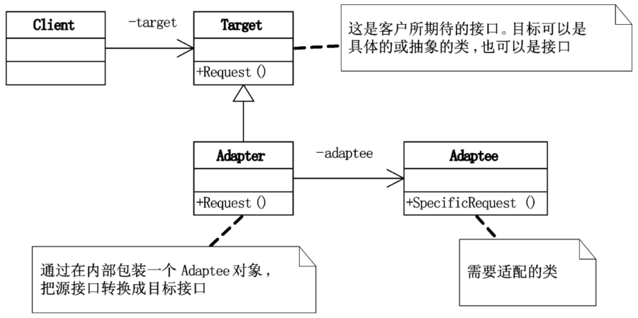

# 适配器模式

适配器模式是将一个类的接口转换成客户希望的另外一个接口。使得原来接口不兼容的类可以一起工作。

**设计动机**

当有满足需求功能的类，但接口不符合要求，或者希望创建一个可以复用的类，该类可以与其他不相关的类或不可预见的类协同工作。

主要目的是希望能复用已有的类，但接口又与复用环境要求不一致。

**使用场景**

- 系统数据和行为正确，但接口不符时。

实际中的例子：复用功能但接口不符，俗称包一层。

**不足之处**

- 代码复杂度增加。

**实现方式**

- 一般在开发后期或维护期，双方都比较稳定、不太容易修改时候才会使用。

