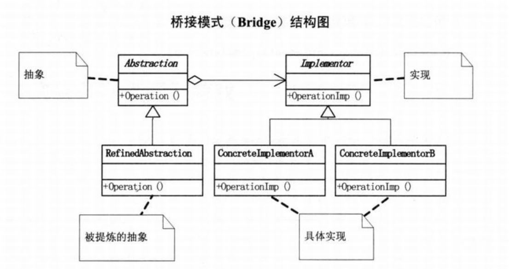

# 桥接模式

<div class="side-by-side-container">
<div class="side-by-side-panel">
<div class="side-by-side-header">📖 原文</div>
<div class="side-by-side-content">

## 模式引入

### 问题描述

对于不同品牌的手机，软件基本无法兼容。因此如果手机需要增加软件，就需要针对不同品牌的手机分别实现软件功能。

### 模式定义

桥接模式是将抽象部分与其实现部分分离，使它们都可以独立地变化。

### 问题分析

实现该问题的程序通常会采用继承方式设计，那么父类和子类之间会具有非常紧密的依赖关系，父类中的任何变化都会影响子类，子类继承的实现如果无法解决新需求就必须重写或替换父类。如此设计会导致类爆炸问题，并且扩展不灵活。

## 模式实现

### 解决方案

核心思想使用合成/聚合原则代替类继承思想设计程序，从而降低耦合度、减少代码量。

首先确定分类的角度，然后把这些实现独立出来，让它们互不干扰相互独立，从而减少耦合。需要注意的是能否找到合适的桥接点，如果没有就不必要非要使用桥接模式。

包括以下四个角色：

- 抽象类（抽象类）：用于定义抽象类的接口，其中定义了一个具有关联关系的实现类 的对象。
- 扩充抽象类（扩充抽象类）：继承并实现抽象类中的接口，并在其中调用实现类 对象的相关业务方法。
- 实现类（实现类）：用于定义实现类的接口，提供基本的业务方法供抽象类调用，以完成复杂的操作。
- 具体实现类（具体实现类）：继承并实现 实现类 的接口，在不同的具体实现类中提供不同的操作方法，通过向上转型的方式完成方法的调用。

### 代码实现

`手机软件` 实现类：

```java
public abstract class 手机软件 {
    public abstract void 运行();
}
```

`手机软件` 具体实现类：

```java
public class 手机游戏 extends 手机软件 {
    @Override
    public void 运行() {
        System.out.println("运行手机游戏");
    }
}

public class 手机通讯录 extends 手机软件 {
    @Override
    public void 运行() {
        System.out.println("运行手机通讯录");
    }
}
```

`手机品牌` 抽象类：

```java
public abstract class 手机品牌 {
    protected 手机软件 软件;

    public void 设置手机软件(手机软件 软件) {
        this.软件 = 软件;
    }

    public abstract void 运行();
}
```

`手机品牌` 扩展抽象类：

```java
public class 手机品牌M extends 手机品牌 {
    @Override
    public void 运行() {
        软件.运行();
    }
}

public class 手机品牌N extends 手机品牌 {
    @Override
    public void 运行() {
        软件.运行();
    }
}
```

`主类` 方法：

```java
public class 主类 {
    public static void main(String[] args) {
        手机品牌 抽象品牌;
        抽象品牌 = new 手机品牌N();

        抽象品牌.设置手机软件(new 手机游戏());
        抽象品牌.运行();

        抽象品牌.设置手机软件(new 手机通讯录());
        抽象品牌.运行();

        抽象品牌 = new 手机品牌M();

        抽象品牌.设置手机软件(new 手机游戏());
        抽象品牌.运行();

        抽象品牌.设置手机软件(new 手机通讯录());
        抽象品牌.运行();
    }
}
```

执行结果：

```bash
运行手机游戏
运行手机通讯录
运行手机游戏
运行手机通讯录
```

### 结构组成



## 模式评价

### 适合场景

- 对于使用较多类继承问题而导致紧耦合、扩展性差的系统。
- 对于存在多个独立变化并需要灵活扩展维度的需求。

### 实际应用

- JDBC 规范和不同数据库厂商驱动的实现。
- Spring 中可以根据客户的需求能够动态切换不同的数据源。
- Nginx 的模块架构就应用了桥接模式，使用了`nginx_module_t` 定义模块，结构体里有若干函数指针和扩展字段，然后桥接实现了丰富多彩的 core、conf、event、stream、http 等功能模块，搭建起整个 Nginx 框架。

### 优点缺点

模式优点：

- 避免了继承导致的类爆炸问题。
- 具备灵活的可扩展性。

模式缺点：

- 将抽象和实现分离会增加设计的难度。

</div>
</div>
  
<div class="side-by-side-panel">
<div class="side-by-side-header">💡 解读</div>
<div class="side-by-side-content">

想象你是一家手机软件公司的开发主管，现在要开发一款游戏和一款通讯录软件。但问题是：

- 市面上有 M 品牌和 N 品牌两种手机
- 不同品牌的手机系统差异很大，软件无法直接兼容
- 每开发一个新软件，都要为每个品牌单独开发一个版本

如果采用传统继承方式：

```
手机软件
├─ M品牌手机游戏
├─ M品牌手机通讯录
├─ N品牌手机游戏
└─ N品牌手机通讯录
```

这样会导致"类爆炸"问题 - 每增加一个品牌或一个软件，类的数量都会成倍增长。

## 桥接模式的解决方案

桥接模式的核心思想是"分离抽象与实现"，具体来说：

1. **分离两个变化维度**：

   - 一个维度是手机品牌（M、N）
   - 另一个维度是软件类型（游戏、通讯录）

2. **通过组合代替继承**：
   - 不再让软件直接继承自特定品牌
   - 而是在手机品牌类中包含一个软件对象

## 代码实现解析

让我们拆解示例代码中的关键部分：

### 1. 软件抽象与实现

```java
public abstract class 手机软件 {
    public abstract void 运行();
}

public class 手机游戏 extends 手机软件 {
    @Override
    public void 运行() {
        System.out.println("运行手机游戏");
    }
}
```

这里定义了软件的抽象和具体实现，与品牌无关。

### 2. 品牌抽象与实现

```java
public abstract class 手机品牌 {
    protected 手机软件 软件;  // 关键：持有软件对象的引用

    public void 设置手机软件(手机软件 软件) {
        this.软件 = 软件;
    }

    public abstract void 运行();
}

public class 手机品牌M extends 手机品牌 {
    @Override
    public void 运行() {
        软件.运行();  // 委托给软件对象执行
    }
}
```

品牌类通过组合方式持有软件对象，而不是通过继承。

### 3. 客户端使用

```java
手机品牌 抽象品牌 = new 手机品牌N();
抽象品牌.设置手机软件(new 手机游戏());
抽象品牌.运行();  // 输出：运行手机游戏
```

可以自由组合任意品牌和任意软件，扩展性极强。

## 桥接模式的结构

用 UML 类图表示：

```
          [抽象部分]                     [实现部分]
        ┌─────────────┐               ┌─────────────┐
        │  手机品牌    │               │  手机软件   │
        ├─────────────┤               ├─────────────┤
        │ +软件:手机软件│<>───────┐    │ +运行()     │
        ├─────────────┤         │    └─────────────┘
        │ +设置手机软件()│         │             △
        │ +运行()      │         │             │
        └─────────────┘         │    ┌───────────────────┐
               △                └────┤  手机品牌M/手机品牌N│
               │                     └───────────────────┘
        ┌─────────────┐
        │ 手机品牌M/N  │
        └─────────────┘
```

## 桥接模式的本质

**多维度的独立变化**：当系统需要在多个维度上独立变化时，使用桥接模式可以避免类数量的爆炸式增长。

**合成/聚合复用原则**：优先使用对象组合，而不是类继承。这使得系统更灵活，耦合度更低。

## 实际应用案例

1. **JDBC 驱动**：

   - 抽象：JDBC 接口
   - 实现：MySQL 驱动、Oracle 驱动等
   - 可以随时切换数据库而不影响业务代码

2. **Spring 数据源**：

   - 抽象：DataSource 接口
   - 实现：不同的连接池实现（HikariCP、DBCP 等）

3. **Nginx 模块架构**：
   - 核心框架与各种功能模块通过桥接模式解耦

## 备考重点

1. **理解"两个变化维度"**：能识别出系统中哪些部分适合使用桥接模式

2. **与适配器模式的区别**：

   - 适配器：解决已有接口不兼容的问题（事后）
   - 桥接：预先设计的抽象与实现分离（事前）

3. **优缺点分析**：

   - 优点：解耦、扩展性强、符合开闭原则
   - 缺点：增加了系统复杂度，需要设计前期考虑

4. **实现关键点**：
   - 识别出系统中变化的维度
   - 将抽象部分与实现部分分离
   - 使用组合关系连接两部分

希望这个解释能帮助你从实际技术角度理解桥接模式！在系统架构设计中，这种解耦思想非常重要，特别是在需要支持多平台、多实现的场景中。

</div>
</div>
</div>
