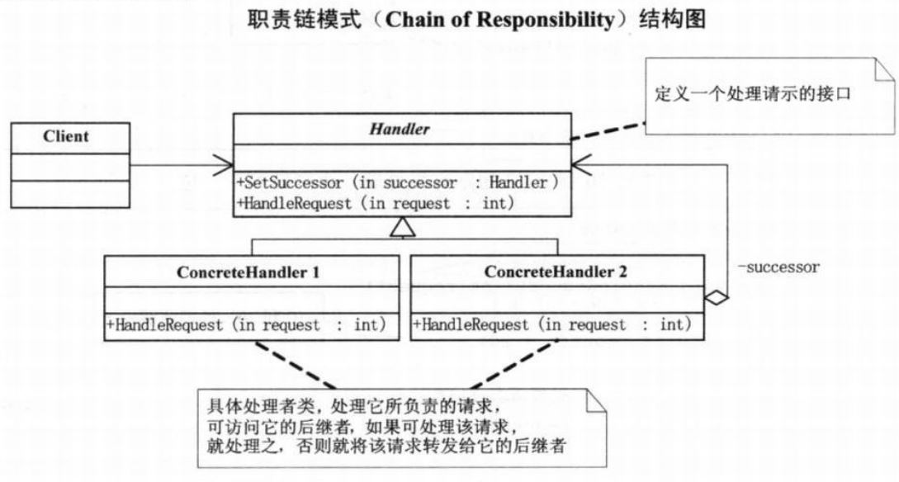

# 职责链模式

## 模式引入

### 问题描述

加薪、请假申请等需要层层审批的场景。比如向经理提加薪申请，经理没权利然后向总监上报，总监没权限然后向总经理汇报等。

### **模式定义**

职责链模式核心是解决服务中先后执行处理关系，从而降低请求发送者和接受者之间的耦合关系。类似于击鼓传花。

### 问题分析

如果将管理者创建成为一个类，那么该类会具有太多的责任，比如经理、总监以及总经理的审批和上报功能，就违背了单一职责原则。而且以后的需求可能会增加新的管理类别，比如项目经理、部门经理、人事总监等，那么就势必会修改管理者类以完成扩展，就违背了开放封闭原则。

## 模式实现

### 解决方案

将公司管理者的类别变成管理者的子类，可以通过多态性来化解分支带来的僵化。然后通过不同管理者之间建立管理关系实现请求的传递，使得请求的发送者和接收者解耦，可以让各服务模块更加清晰。处理者负责处理请求，客户只需要将请求发送到职责链，无需关心具体的处理细节。

处理者（处理者）：用于定义一个处理请示的接口。

具体处理者（具体处理者）：处理它所负责的请求，可访问它的后继者，如果能够处理就处理，否则就将请求转发给它的后继者。

### 代码实现

`请求` 类：

```java
public class 请求 {
    private String 请求类型;
    private String 请求内容;
    private int 数量;

    public String 获取请求类型() {
        return 请求类型;
    }

    public void 设置请求类型(String 请求类型) {
        this.请求类型 = 请求类型;
    }

    public String 获取请求内容() {
        return 请求内容;
    }

    public void 设置请求内容(String 请求内容) {
        this.请求内容 = 请求内容;
    }

    public int 获取数量() {
        return 数量;
    }

    public void 设置数量(int 数量) {
        this.数量 = 数量;
    }
}
```

`管理者` 类：

```java
public abstract class 管理者 {
    protected String 姓名;
    protected 管理者 上级;

    protected 管理者(String 姓名) {
        this.姓名 = 姓名;
    }

    public void 设置上级(管理者 上级) {
        this.上级 = 上级;
    }

    public abstract void 处理请求(请求 请求对象);
}
```

`具体管理者` 类：

```java
public class 总经理 extends 管理者 {
    protected 总经理(String 姓名) {
        super(姓名);
    }

    @Override
    public void 处理请求(请求 请求对象) {
        if(请求对象.获取请求类型() == "请假"){
            System.out.println(姓名 + "：" + 请求对象.获取请求内容() + " 数量" + 请求对象.获取数量() + " 被批准" );
        }else if(请求对象.获取请求类型() == "加薪" && 请求对象.获取数量() <= 500) {
            System.out.println(姓名 + "：" + 请求对象.获取请求内容() + " 数量" + 请求对象.获取数量() + " 被批准" );
        }else {
            System.out.println(姓名 + "：" + 请求对象.获取请求内容() + " 数量" + 请求对象.获取数量() + " 再说吧" );
        }
    }
}

public class 总监 extends 管理者 {
    protected 总监(String 姓名) {
        super(姓名);
    }

    @Override
    public void 处理请求(请求 请求对象) {
        if(请求对象.获取请求类型() == "请假" && 请求对象.获取数量() <= 5) {
            System.out.println(姓名 + "：" + 请求对象.获取请求内容() + " 数量" + 请求对象.获取数量() + " 被批准" );
        }else {
            if(上级 != null) {
                上级.处理请求(请求对象);
            }
        }
    }
}

public class 普通经理 extends 管理者 {
    protected 普通经理(String 姓名) {
        super(姓名);
    }

    @Override
    public void 处理请求(请求 请求对象) {
        if(请求对象.获取请求类型() == "请假" && 请求对象.获取数量() <= 2) {
            System.out.println(姓名 + "：" + 请求对象.获取请求内容() + " 数量" + 请求对象.获取数量() + " 被批准" );
        }else {
            if(上级 != null) {
                上级.处理请求(请求对象);
            }
        }
    }
}
```

`主类` 方法：

```java
public class 主类 {
    public static void main(String[] args) {
        普通经理 普通经理 = new 普通经理("金利");
        总监 总监 = new 总监("宗剑");
        总经理 总经理 = new 总经理("钟精励");
        普通经理.设置上级(总监);
        总监.设置上级(总经理);

        请求 请求对象 = new 请求();
        请求对象.设置请求类型("请假");
        请求对象.设置请求内容("小菜请假");
        请求对象.设置数量(1);
        普通经理.处理请求(请求对象);

        请求 请求对象2 = new 请求();
        请求对象2.设置请求类型("请假");
        请求对象2.设置请求内容("小菜请假");
        请求对象2.设置数量(4);
        普通经理.处理请求(请求对象2);

        请求 请求对象3 = new 请求();
        请求对象3.设置请求类型("加薪");
        请求对象3.设置请求内容("小菜请求加薪");
        请求对象3.设置数量(500);
        普通经理.处理请求(请求对象3);

        请求 请求对象4 = new 请求();
        请求对象4.设置请求类型("加薪");
        请求对象4.设置请求内容("小菜请求加薪");
        请求对象4.设置数量(1000);
        普通经理.处理请求(请求对象4);
    }
}
```

执行结果：

```bash
金利：小菜请假 数量1 被批准
宗剑：小菜请假 数量4 被批准
钟精励：小菜请求加薪 数量500 被批准
钟精励：小菜请求加薪 数量1000 再说吧
```

### 结构组成



## 模式评价

### 适用场景

一个请求有多个对象可以处理，但每个对象的处理条件或权限不同。

### 实际应用

- Netty 中 Pipeline 与 ChannelHandler 通过责任链来组织代码逻辑。
- Tomcat 中 Servlet 过滤器使用了责任链模式。
- Spring 中切面编程和安全机制都使用了责任链模式。

### 优点缺点

模式优点：

- 能够简化对象的相互连接，接收者和发送者都没有对方的明确信息，且链中的对象也不知道链的结构。
- 避免了请求的发送者和接受者之间的耦合关系。
- 能够随时修改请求的结构，增强了给对象指派职责的灵活性

模式缺点：

- 请求可能到了链的末端都得不到处理，或者因为没有正确配置得不到处理。
- 较长的责任链可能会影响到系统的性能。


