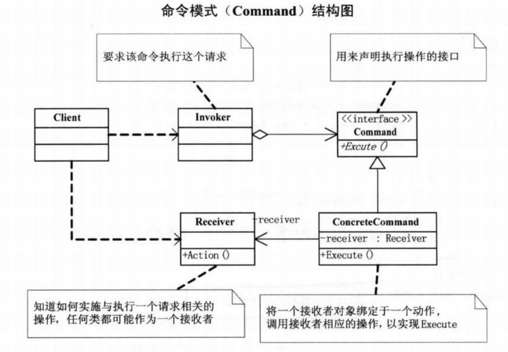

# 命令模式

## 问题引入

### 问题描述

对于烧烤摊场景，由于客户和烤肉串老板的紧耦合所以容易出错，也容易挑剔。可以通过引入服务员完成点菜等请求排队以及退单等可撤销的操作之类的行为，实现客户和烤肉串老板的关系解耦。

### **模式定义**

将请求封装为命令对象，通过数据驱动的方式将命令对象用构造函数的方式传递给调用者，调用者再根据具体的实现执行相应的命令。顺序：调用者→命令→接受者。

### 问题分析

在系统中行为请求请求者和行为实现者通常是紧耦合的，对于请求排队或记录请求日志，以及支持可撤销的操作等行为，这种紧耦合不合适。

## 模式介绍

### 解决方案

将调用操作的请求对象与实现操作的接受对象解耦，顺序为调用者->命令->接受者。

抽象命令类（抽象命令类），用来声明执行操作的接口。

具体命令类（具体命令类），命令的具体实现，将接收者对象与动作绑定，从而调用接收者相应的操作完成命令。

调用者（调用者），调用命令实现某个请求。

接收者（接收者），实施与执行与请求相关的操作。

### 代码实现

```java
public abstract class 命令 {
    protected 烧烤者 接收者;

    public 命令(烧烤者 接收者) {
        this.接收者 = 接收者;
    }

    public abstract void 执行命令();
}

public class 烤鸡翅命令 extends 命令 {
    public 烤鸡翅命令(烧烤者 接收者) {
        super(接收者);
    }

    @Override
    public void 执行命令() {
        接收者.烤鸡翅();
    }
}

public class 烤羊肉串命令 extends 命令 {
    public 烤羊肉串命令(烧烤者 接收者) {
        super(接收者);
    }

    @Override
    public void 执行命令() {
        接收者.烤羊肉串();
    }
}

public class 服务员 {
    private List<命令> 订单列表 = new ArrayList<>();

    public void 设置订单(命令 命令对象) {
        if (命令对象.getClass().toString().equals("class design_patterns.java.command.烤鸡翅命令")) {
            System.out.println("服务员：鸡翅没有了，请点别的烧烤。");
        }else {
            订单列表.add(命令对象);
            System.out.print("增加订单：" + 命令对象.getClass().toString());
            System.out.println(" 时间：" + new Date());
        }
    }

    public void 取消订单(命令 命令对象) {
        订单列表.remove(命令对象);
        System.out.print("取消订单：" + 命令对象.getClass().toString());
        System.out.println(" 时间：" + new Date());
    }

    public void 执行订单() {
        for(命令 命令对象 : 订单列表){
            命令对象.执行命令();
        }
    }
}

public class 烧烤者 {
    public void 烤羊肉串() {
        System.out.println("烤羊肉串！");
    }

    public void 烤鸡翅() {
        System.out.println("烤鸡翅！");
    }
}

public class 主类 {
    public static void main(String[] args) {
        // 开店前的准备
        烧烤者 烧烤师傅 = new 烧烤者();
        命令 烤羊肉串命令1 = new 烤羊肉串命令(烧烤师傅);
        命令 烤羊肉串命令2 = new 烤羊肉串命令(烧烤师傅);
        命令 烤鸡翅命令1 = new 烤鸡翅命令(烧烤师傅);
        服务员 女服务员 = new 服务员();

        // 开门营业
        女服务员.设置订单(烤羊肉串命令1);
        女服务员.设置订单(烤羊肉串命令2);
        女服务员.设置订单(烤鸡翅命令1);
        女服务员.执行订单();
    }
}


```

### **结构**组成



## 模式评价

**适合场景**

所有能当作命令的场景下都可以考虑使用命令模式

**实际应用**

1.Spring 框架的 JdbcTemplate 

2.JDK中的Runnable接口的运用

**模式优点**

通过分离调用者和请求者降低系统的耦合度，可扩展性强。

**模式缺点**

导致出现过多的命令类。

