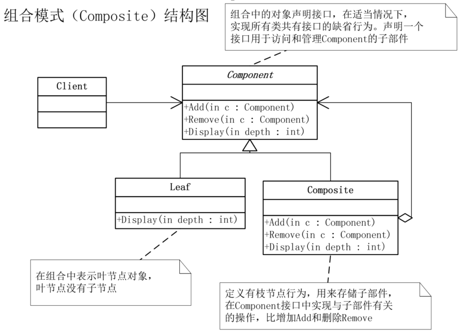

# 组合模式

## 模式引入

### 问题描述

假设我们要给一家公司做一个 OA 系统，公司总部在北京，全国几个大城市都有子公司，其他一些省会城市是办事处，有些城市还设置了大区。总部有职能部门，各个子公司也有自己的职能部门。这是一个明显的树状结构，最简单的想法是针对不同类型（如公司或部门）组织创建不同的对象，组织之间的交互在其内部实现。但是这样有不少问题，比如无法体现公司的组织结构，交互的实现复杂混乱，新增类型时工作量巨大等等。而且对用户来说，这不同类型其实是类似的——都是组织。

### 模式定义

像刚刚这种具有层级结构，且组成对象具有一致性的情况，就适合使用组合模式。

组合模式（Composite）是将对象组合成树形结构以表示 “部分-整体” 的层次结构，组合模式使得用户对单个对象和组合对象的使用具有一致性。

### 问题分析

使用组合模式解决上面的问题，总部是根节点，下面有各个职能部门以及与其平行的子公司，每个子公司下面又有自己的职能部门。

## 模式实现

### 解决方案

- 首先需要一个抽象类：`公司`，可以是一个公司或部门。包括 `添加`、`移除`、`显示` 等方法。
- 然后分别实现树枝节点具体公司类：`具体公司` 和树叶节点：`人力资源部门` 和 `财务部门`，并重写抽象方法。

### 代码实现

`组件` 类：

```java
public abstract class 公司 {
    protected String 名称;

    public 公司(String 名称) {
        this.名称 = 名称;
    }

    public abstract void 添加(公司 c);
    public abstract void 移除(公司 c);
    public abstract void 显示(int 深度);
    public abstract void 履行职责();
}
```

`组合` 类：

```java
public class 具体公司 extends 公司 {

    private List<公司> 子节点 = new ArrayList<>();

    public 具体公司(String 名称) {
        super(名称);
    }

    @Override
    public void 添加(公司 c) {
        子节点.add(c);
    }

    @Override
    public void 移除(公司 c) {
        子节点.remove(c);
    }

    @Override
    public void 显示(int 深度) {
        for(int i = 0; i < 深度; i++) {
            System.out.print("-");
        }
        System.out.println(this.名称);

        for(公司 组件 : 子节点) {
            组件.显示(深度 + 2);
        }
    }

    @Override
    public void 履行职责() {
        for(公司 组件 : 子节点) {
            组件.履行职责();
        }
    }
}
```

`叶子` 类：

```java
public class 人力资源部门 extends 公司 {

    public 人力资源部门(String 名称) {
        super(名称);
    }

    @Override
    public void 添加(公司 c) {}

    @Override
    public void 移除(公司 c) {}

    @Override
    public void 显示(int 深度) {
        for(int i = 0; i < 深度; i++) {
            System.out.print("-");
        }
        System.out.println(this.名称);
    }

    @Override
    public void 履行职责() {
        System.out.println(this.名称 + " 员工招聘培训管理");
    }
}

public class 财务部门 extends 公司 {
    public 财务部门(String 名称) {
        super(名称);
    }

    @Override
    public void 添加(公司 c) {}

    @Override
    public void 移除(公司 c) {}

    @Override
    public void 显示(int 深度) {
        for(int i = 0; i < 深度; i++) {
            System.out.print("-");
        }
        System.out.println(this.名称);
    }

    @Override
    public void 履行职责() {
        System.out.println(this.名称 + " 公司财务收支管理");
    }
}
```

`主类` 方法：

```java
public class 主类 {
    public static void main(String[] args) {
        具体公司 根节点 = new 具体公司("北京总公司");
        根节点.添加(new 人力资源部门("总公司人力资源部"));
        根节点.添加(new 财务部门("总公司财务部"));

        具体公司 分公司 = new 具体公司("上海华东分公司");
        分公司.添加(new 人力资源部门("华东分公司人力资源部"));
        分公司.添加(new 财务部门("华东分公司财务部"));
        根节点.添加(分公司);

        具体公司 办事处1 = new 具体公司("南京办事处");
        办事处1.添加(new 人力资源部门("南京办事处人力资源部"));
        办事处1.添加(new 财务部门("南京办事处财务部"));
        根节点.添加(办事处1);

        具体公司 办事处2 = new 具体公司("杭州办事处");
        办事处2.添加(new 人力资源部门("杭州办事处人力资源部"));
        办事处2.添加(new 财务部门("杭州办事处财务部"));
        根节点.添加(办事处2);

        System.out.println("\n结构图：");
        根节点.显示(1);

        System.out.println("\n职责：");
        根节点.履行职责();
  }
}
```

执行结果：

```bash
结构图：
-北京总公司
---总公司人力资源部
---总公司财务部
---上海华东分公司
-----华东分公司人力资源部
-----华东分公司财务部
---南京办事处
-----南京办事处人力资源部
-----南京办事处财务部
---杭州办事处
-----杭州办事处人力资源部
-----杭州办事处财务部

职责：
总公司人力资源部 员工招聘培训管理
总公司财务部 公司财务收支管理
华东分公司人力资源部 员工招聘培训管理
华东分公司财务部 公司财务收支管理
南京办事处人力资源部 员工招聘培训管理
南京办事处财务部 公司财务收支管理
杭州办事处人力资源部 员工招聘培训管理
杭州办事处财务部 公司财务收支管理
```

### 结构组成



- 组件（对象接口）：主要实现所有类共有接口的默认行为，声明一个接口，用于访问和管理 组件 的子部件。
- 组合（枝节点）：定义枝节点行为，用于存储子部件，在 组件 接口中实现与子部件有关的操作，比如增加（添加）和删除（移除）。
- 叶子（叶节点）：表示叶节点对象，叶节点没有子节点。

## 模式评价

### 适用场景

- 体现部分与整体层次的结构时。比如例子中具有层级结构的组织结构。
- 希望用户忽略组合对象与单个对象的不同，统一使用组合结构中的所有对象时。

### 实际应用

- 公司管理系统。如例子所示。
- 文件系统。文件系统是一个典型的树状层级结构。
- 编译器。编译器会将代码最终解析为一棵语法树。

### 优点缺点

组合模式优点包括：

- 让用户可以一致地使用组合结构和对象。比如例子中的子公司和部门。
- 组合对象可以自由增删组件，灵活组合不同对象。

组合模式缺点包括：

- 层级太深时结构会变得庞杂。
