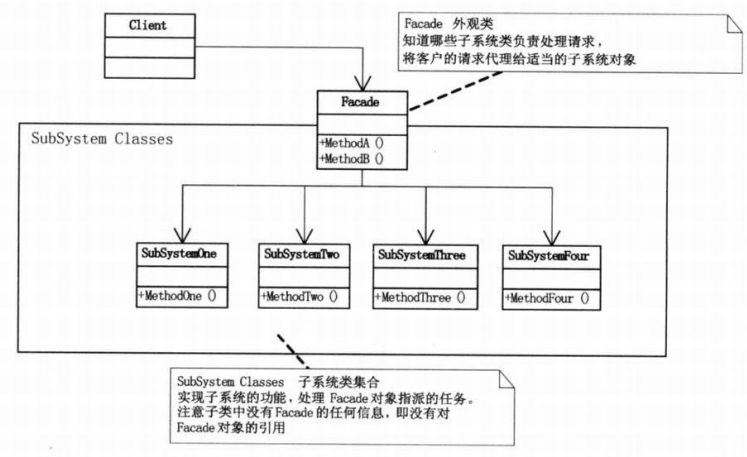

# 外观模式

<div class="side-by-side-container">
<div class="side-by-side-panel">
<div class="side-by-side-header">📖 原文</div>
<div class="side-by-side-content">

## 模式引入

### 问题描述

新手开始炒股，是很容易亏钱的。因为要了解的知识很多，刚开始心态也很不稳定。此时，基金是一个很好的帮手，它将投资者分散的基金集中起来，交给专业的经理人管理和投资。

我们进一步分析可以发现：投资者与众多股票的联系太多，耦合性过高，反而不利于操作。而有了基金后，投资者只需和基金打交道，降低了耦合性。

### 模式定义

`外观模式（Facade）`，为子系统中的一组接口提供了一个一致的界面。此模式定义了一个高层接口，这个接口使得子系统更容易使用。

外观模式属于结构型模式。

- 外观模式在客户端和复杂系统间加了一层，这一层负责处理调用顺序和依赖关系等；

- 外观模式隐藏了系统的复杂性，向客户端提供了一个可访问系统的接口。

### 问题分析

- 用户与众多股票的联系太多，不利于操作，耦合性过高；
- 设置基金类，用户只需跟基金打交道，关心基金的涨跌即可。

## 模式介绍

### 解决方案

- 创建基金类。基金类需要了解所有股票的方法或属性，进行组合，方便外界调用；
- 在客户端调用时，不需要了解股票，只需调用基金。

### 代码实现

股票 1 的具体类：

```java
public class 股票1 {
    public void 卖出() {
        System.out.println("股票1卖出");
    }

    public void 买入() {
        System.out.println("股票1买入");
    }
}
```

股票 2 的具体类：

```java
public class 股票2 {
    public void 卖出() {
        System.out.println("股票2卖出");
    }

    public void 买入() {
        System.out.println("股票2买入");
    }
}
```

股票 3 的具体类

```java
public class 股票3 {
    public void 卖出() {
        System.out.println("股票3卖出");
    }

    public void 买入() {
        System.out.println("股票3买入");
    }
}
```

房地产的具体类：

```java
public class 房地产1 {
    public void 卖出() {
        System.out.println("房地产1卖出");
      }

    public void 买入() {
        System.out.println("房地产1买入");
    }
}
```

国债 1 的具体类：

```java
public class 国债1 {
    public void 卖出() {
        System.out.println("国债1卖出");
      }

    public void 买入() {
        System.out.println("国债1买入");
    }
}
```

基金类：

```java
public class 基金 {
    private 股票1 股1;
    private 股票2 股2;
    private 股票3 股3;
    private 国债1 债1;
    private 房地产1 房1;

    public 基金() {
        股1 = new 股票1();
        股2 = new 股票2();
        股3 = new 股票3();
        债1 = new 国债1();
        房1 = new 房地产1();
    }

    public void 买入基金() {
        股1.买入();
        股2.买入();
        股3.买入();
        债1.买入();
        房1.买入();
    }

    public void 卖出基金() {
        股1.卖出();
        股2.卖出();
        股3.卖出();
        债1.卖出();
        房1.卖出();
    }
}
```

客户端方法：

```java
public class 外观主类 {
    public static void main(String[] args) {
        基金 基金 = new 基金();
        基金.买入基金();
        基金.卖出基金();
    }
}
```

执行结果：

```bash
股票1买入
股票2买入
股票3买入
国债1买入
房地产1买入
股票1卖出
股票2卖出
股票3卖出
国债1卖出
房地产1卖出
```

### 结构组成

外观类，需要了解所有子系统的方法或属性，进行组合，以便外界调用。



- SubSystem: 子系统的类；
- Facade：外观类，需要了解所有子系统的方法或属性，进行组合，以备外界调用；
- Client：客户端调用。由于 Facade 的存在，客户端不需要知道三个子系统类的存在。

## 模式评价

### 适用场景

客户端不需要知道系统内部的复杂联系，整个系统只需提供一个"接待员"即可。

### 实际应用

- 三层开发模式
  - 设计初期，在层与层直接建立外观模式；
  - 开发阶段，子系统经常因为不断的重构变得更复杂。外观模式可以提供加简单的接口，方便外部调用；
  - 维护遗留的大系统时，为新系统开发一个外观模式，让新系统与 Facade 对象交互，Facade 与遗留代码交互。
- 医院看病，挂号、门诊、划价、取药，让患者觉得很复杂。设有接待人员，就很方便。

### 优点缺点

优点：

- 减少了系统间的相互依赖
- 提高了灵活性

缺点：

不符合开闭原则。如果要改东西很麻烦，继承和重写都不合适。

</div>
</div>
  
<div class="side-by-side-panel">
<div class="side-by-side-header">💡 解读</div>
<div class="side-by-side-content">
# 外观模式（Facade Pattern）深入解析

## 通俗理解外观模式

就像你举的基金例子一样，外观模式就像是一个"中介"或"接待员"。想象一下：

- **没有基金的情况**：投资者需要自己研究每只股票、房地产、国债，分别买入卖出，工作量大且复杂
- **有基金的情况**：投资者只需告诉基金"买入"或"卖出"，基金内部自动处理所有具体投资品种的操作

在软件系统中，外观模式扮演的就是这个"基金"的角色，它封装了复杂的子系统操作，对外提供简单的接口。

## 技术角度深入解析

### 核心思想

外观模式的核心是**简化接口**和**解耦**。它通过创建一个统一的接口，来隐藏系统的复杂性，使得客户端不需要了解系统内部的复杂实现。

### 架构师视角的分析

1. **分层架构中的应用**：

   - 在多层架构中，外观模式常用于业务逻辑层和数据访问层之间
   - 例如：`UserFacade`可能封装了用户注册、登录、权限检查等多个子系统的操作

2. **系统集成中的应用**：

   - 当系统需要集成多个第三方服务时，可以创建一个外观类统一管理
   - 例如：`PaymentFacade`可能封装了支付宝、微信支付、银联等多个支付渠道

3. **微服务架构中的应用**：
   - 可以作为 API Gateway 的基础模式
   - 为前端提供聚合后的服务接口，避免前端直接调用多个微服务

### 代码实现的深入理解

从你提供的代码示例，我们可以更深入地分析：

```java
public class 基金 {
    private 股票1 股1;
    private 股票2 股2;
    // 其他成员变量...

    public void 买入基金() {
        股1.买入();
        股2.买入();
        // 其他买入操作...
    }
}
```

这里的关键点：

1. 基金类**组合**了所有子系统类（股票、债券等）
2. 对外提供**统一的操作接口**（买入基金、卖出基金）
3. 客户端完全不知道内部有哪些具体投资品种

### 模式结构详解

```
+----------------+       +----------------+
|    Client      |------>|    Facade      |
+----------------+       +----------------+
                                |
        +-----------------------+-----------------------+
        |                       |                       |
+----------------+    +----------------+    +----------------+
| SubSystem A    |    | SubSystem B    |    | SubSystem C    |
+----------------+    +----------------+    +----------------+
```

- **Facade**：知道哪些子系统负责处理请求，将客户端请求代理给适当的子系统对象
- **SubSystem**：实现子系统的功能，处理由 Facade 指派的任务，但不知道 Facade 的存在

### 实际应用场景

1. **数据库访问**：

   ```java
   public class DatabaseFacade {
       private MySQLConnection mysql;
       private OracleConnection oracle;

       public void connect(String config) {
           // 根据配置初始化合适的数据库连接
       }

       public Result executeQuery(String sql) {
           // 统一处理SQL执行
       }
   }
   ```

2. **电商系统订单处理**：
   ```java
   public class OrderFacade {
       private InventorySystem inventory;
       private PaymentSystem payment;
       private ShippingSystem shipping;

       public boolean placeOrder(Order order) {
           if(!inventory.checkStock(order)) return false;
           if(!payment.processPayment(order)) return false;
           shipping.scheduleDelivery(order);
           return true;
       }
   }
   ```

### 优缺点深度分析

**优点**：

1. **降低复杂度**：将复杂的子系统调用简化为几个高层接口
2. **松耦合**：客户端与子系统解耦，子系统内部变化不影响客户端
3. **提高可维护性**：将散落在各处的调用逻辑集中管理
4. **安全性控制**：可以在 Facade 中统一进行权限校验、日志记录等

**缺点**：

1. **违反开闭原则**：新增功能可能需要修改 Facade 类
2. **可能成为"上帝对象"**：如果 Facade 过于庞大，会变成新的复杂性来源
3. **性能考虑**：额外的抽象层可能带来轻微的性能开销

### 架构设计中的权衡

作为架构师，在使用外观模式时需要考虑：

1. **粒度控制**：Facade 的粒度要适中，既不能太细（失去简化意义），也不能太粗（变成新的复杂系统）
2. **与其它模式的结合**：
   - 可以结合工厂模式创建子系统对象
   - 可以结合单例模式管理 Facade 实例
3. **演进策略**：初期可以先实现简单 Facade，随着系统复杂再逐步重构

## 备考建议

对于软考高级系统架构师考试，建议重点掌握：

1. 能够绘制外观模式的 UML 类图
2. 理解外观模式与中介者模式的区别
   - 外观模式是单向的（客户端 → 子系统）
   - 中介者模式是多向的（各同事类通过中介者交互）
3. 掌握外观模式在分层架构中的应用
4. 能够分析给定场景是否适合使用外观模式

希望这个深入解析能帮助你更好地理解外观模式！备考过程中可以多思考如何将这个模式应用到实际的系统架构设计中。

</div>
</div>
</div>
