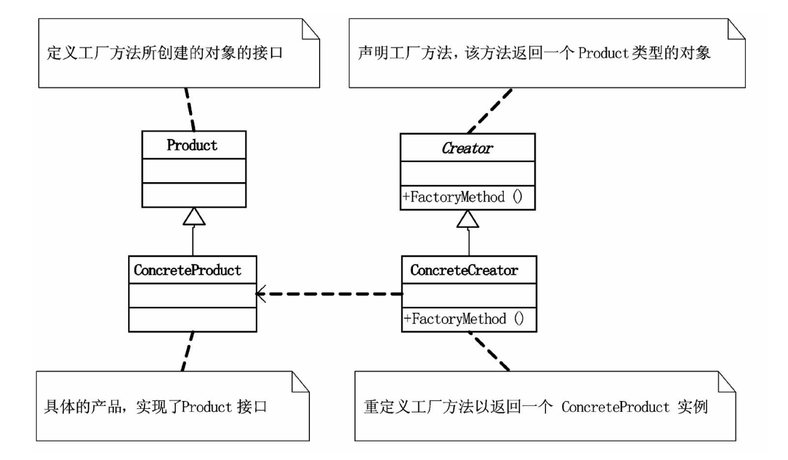

# 工厂方法模式

## 问题引入

### 问题描述

大学生薛磊风在过去三年里一直在帮助孤寡老人，每周都去老人家里，为老人洗衣扫地、买米买油。有一次，他不幸受了伤，便委托他的两个同学继续去帮助老人，且不必提及任何人的名字，只需说是学雷锋做好事即可。

帮助老人是长期工作，三名“学雷锋的大学生”毕业后，也依然会以“社区志愿者”的名义继续学雷锋做好事。而老人其实不需要知道是谁来做好事，只需要知道是学雷锋的人来帮助就可以了。

上述过程在程序实现时，我们如果使用“学雷锋的大学生”封装学雷锋者并调用，当他们毕业时，我们需要以“社区志愿者”重新封装，重新调用，要想使代码变更量少，可以用`工厂方法模式`来实现。

### 模式定义

`工厂方法模式（Factory Method Pattern）`是指定义一个用于创建对象的结构，让子类决定实例化哪个类。工厂方法使类的实例化过程延迟到其子类。

`工厂方法模式`实现时，客户端需要决定实例化哪一个工厂来实现功能类，即将简单工厂内部的逻辑判断已到了客户端进行。

### 问题分析

这一程序可以先用`简单工厂模式`实现，但由于学雷锋的学生毕业后，会转变身份成为社区志愿者，此时若使用简单工厂模式会涉及到工厂类的修改，违背开放封闭原则。当我们使用`工厂方法模式`时，可以对学雷锋的学生和社区志愿者分别建立工厂类，让客户端决定实例化哪一个工厂类。

## 模式实现

### 解决方案

此时可以考虑使用`工厂方法模式`来解决问题。
1. 创建抽象类`LetFeng`，同时定义公共接口，即三种好事：      
    * 定义方法`Sweep()`，`Wash()`，`BuyRice()`。
2. 创建具体的做好事的类：学雷锋的大学生`Undergraduate`，及社区志愿者`Volunteer`，继承于抽象类`LetFeng`；
3. 创建雷锋工厂类`IFactory`，再定义学雷锋的大学生工厂`UndergraduateFactory`和社区志愿者工厂`VolunteerFactory`继承于雷锋工厂，用于创建具体的对象。

### 代码实现

*此处我们使用Java语言来实现这一方案，C#语言实现可见原书原版，本项目的所有语言实现可见本项目Github仓库，其中包括：[C++](https://github.com/datawhalechina/sweetalk-design-pattern/tree/main/src/design_patterns/cpp/factory_method/)，[Java](https://github.com/datawhalechina/sweetalk-design-pattern/tree/main/src/design_patterns/java/factory_method/example)，[python](https://github.com/datawhalechina/sweetalk-design-pattern/tree/main/src/design_patterns/python/factory_method/LeiFengFactory.py)，读者可按需参阅。*

首先创建抽象类`雷锋`。

```Java
public class 雷锋 {
    public void 扫地() {
        System.out.println("Sweep");
    }

    public void 洗衣() {
        System.out.println("Wash");
    }

    public void 买米() {
        System.out.println("Buy rice");
    }
}
```

创建做好事的类，学雷锋的大学生`大学生类`，及社区志愿者`志愿者类`。

```Java
public class 大学生类 extends 雷锋 {
    
}

public class 志愿者类 extends 雷锋 {
    
}
```

创建雷锋工厂类`工厂接口`，再定义学雷锋的大学生工厂`大学生工厂`和社区志愿者工厂`志愿者工厂`

```Java
public interface 工厂接口 {
    public 雷锋 创建雷锋();
}

public class 大学生工厂 implements 工厂接口 {
    @Override
    public 雷锋 创建雷锋() {
        return new 大学生类();
    }
}

public class 志愿者工厂 implements 工厂接口 {
    @Override
    public 雷锋 创建雷锋() {
        return new 志愿者类();
    }
}
```

客户端如下。

```java
public class 工厂方法客户端 {
    public static void main(String[] args) {
        工厂接口 工厂 = new 大学生工厂();
        雷锋 学生 = 工厂.创建雷锋();
        学生.买米();
        学生.扫地();
        学生.洗衣();

        雷锋 志愿者 = new 志愿者工厂().创建雷锋();
        志愿者.买米();
        志愿者.扫地();
        志愿者.洗衣();
      }
}
```

运行结果如下。
```
买米
扫地
洗衣
买米
扫地
洗衣
```

### 结构组成

工厂方法模式由三个主要角色组成：
 1. 访问接口：在这个例子中具体为雷锋类；
 2. 实体类：在这个例子中具体为做好事的类；
 3. 工厂类：在这个例子中具体为各类工厂。

工厂方法模式的通用结构示意图如下。



## 模式实现

### 适用场景

有明确的根据不同条件创造实例的计划时。将类类比为产品，产品具有系列/组合的形式，则使用者可以在不清楚类生产的具体过程及一个系列/组合的类包含的具体内容的情况下，使用一个系列的产品。    

有以下几类适合场景
* 无法预知对象确切类别及其依赖关系时，工厂方法能将创建产品的代码与实际使用产品的代码分离，从而能在不影响其他代码的情况下扩展产品创建的部分。
* 希望用户能扩展软件库/框架的内部组件。

### 实际应用

* 向一个已有多种运输方式（如卡车等）的物流应用新增一种运输方式：轮船。

### 优点缺点

工厂方法模式的优点包括

* 可以避免创建者和具体产品之间的紧密耦合；
* 扩展性高，如果想增加一个新的产品，只需要扩展一个工厂类就可以；
* 符合“开放封闭原则”，无需更改现有工厂类代码，就可以引入新的功能；
* 符合“单一职责原则”，可以将产品创建代码放在程序的单一位置，从而使得代码更容易维护。

工厂方法模式的缺点包括

* 代码可能变得复杂，因为需要引入许多类。


## 参考资料
1. 《深入设计模式》

