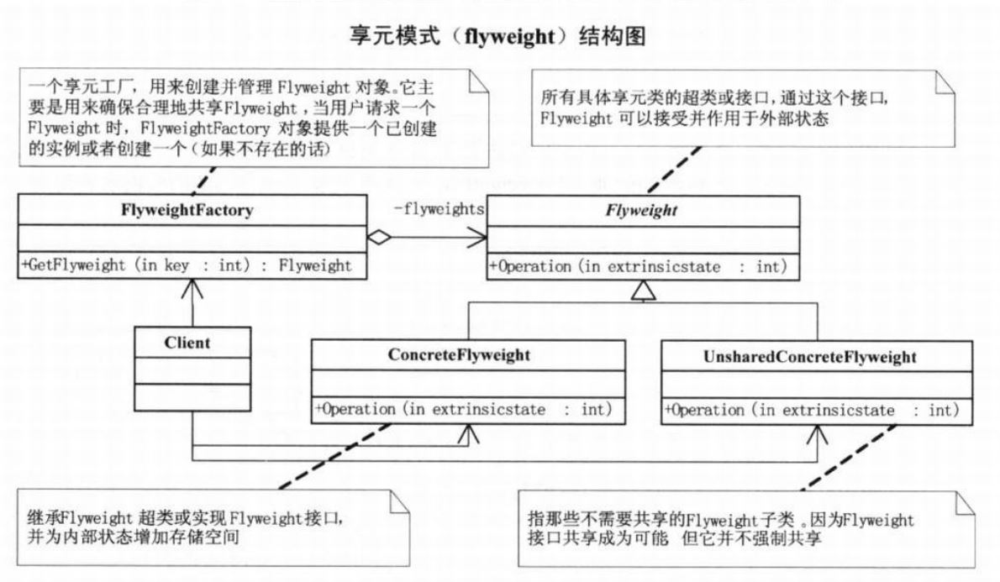

# 享元模式

## 问题引入

### 问题描述

菜鸟的朋友们都希望提供定制的网站，有的希望是新闻发布形式的、有的希望是博客形式的、有的希望是产品图片加说明形式的，但是都希望费用上能大大降低。如果每个网站都独立租用空间费用上基本不能减低，而且维护众多网站的代码需要投入很大的时间和精力。

### **模式定义**

享元模式，运用共享技术有效地支持大量细粒度的对象。

### 问题分析

网站系统的功能相似度很高，如果独立开发，对于出现bug或者新的需求变动会造成极高的维护量。

## 模式介绍

### 解决方案

通过享元模式可以避免大量非常相似类的开销，实现资源的共享。

Flyweight(享元的抽象类)：是所有具体享元类的超类或接口，通过该接口，可以接受并作用于外部状态。

ConcreteFlweight(具体享元类)：继承并扩展抽象类的方法，并为内部状态增加存储空间。

UnsharedConcreteFlyweight(非共享享元子类)：不需要共享的享元子类。

FlyweightFactory(享元工厂)：用来创建并管理享元对象，确保合理的共享资源。

### 代码实现

```java
public abstract class 网站 {
    public abstract void 使用(用户 用户对象);
}

public class 具体网站 extends 网站 {
    private String 名称;
    public 具体网站(String 名称) {
        this.名称 = 名称;
    }

    @Override
    public void 使用(用户 用户对象) {
        System.out.println("网站分类："+ 名称 + " 用户：" + 用户对象.获取姓名());
    }
}

public class 网站工厂 {
    private Map<String,网站> 享元池 = new HashMap<>();

    public 网站 获取网站分类(String 分类键) {
        if(!享元池.containsKey(分类键)) {
            享元池.put(分类键, new 具体网站(分类键));
        }
        return 享元池.get(分类键);
    }

    public int 获取网站数量() {
        return 享元池.size();
    }
}

public class 主类 {
    public static void main(String[] args) {
        网站工厂 工厂 = new 网站工厂();

        网站 网站对象1 = 工厂.获取网站分类("产品展示");
        网站对象1.使用(new 用户("小菜"));

        网站 网站对象2 = 工厂.获取网站分类("产品展示");
        网站对象2.使用(new 用户("大鸟"));

        网站 网站对象3 = 工厂.获取网站分类("产品展示");
        网站对象3.使用(new 用户("娇娇"));

        网站 网站对象4 = 工厂.获取网站分类("博客");
        网站对象4.使用(new 用户("老顽童"));

        网站 网站对象5 = 工厂.获取网站分类("博客");
        网站对象5.使用(new 用户("桃谷六仙"));

        网站 网站对象6 = 工厂.获取网站分类("博客");
        网站对象6.使用(new 用户("南海鳄神"));

        System.out.println("得到网站分类总数为 " + 工厂.获取网站数量());
    }
}

```

### **结构组成**



## 模式评价

**适合场景**

一个是程序中大量的对象造成了较大的存储开销。另一个是对象的大多数状态可以外部状态，如果删除对象的外部状态，就可以用相对较少的共享对象取代很多组对象。

**实际应用**

1.jdk中基本类型的包装类的缓存机制。

2.数据库连接池等池化技术也运用了享元模式的思想。

**模式优点**

实现代码和资源的共享，减少了维护成本

