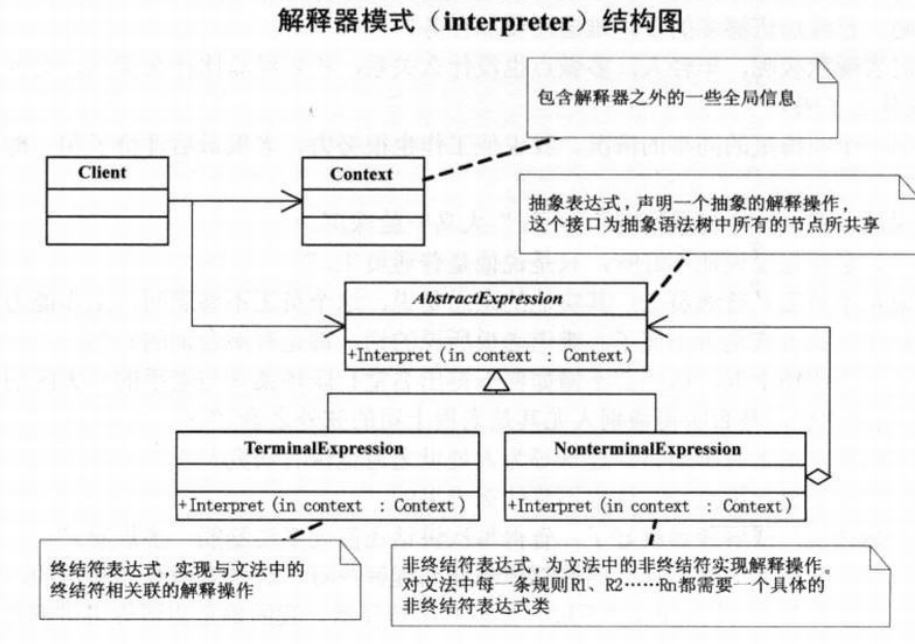

# 解释器模式

## 问题引入

### 问题描述

音乐解释器程序，根据自定义规则将音乐解释成简谱。

### **模式定义**

解释器模式，给定一个语言，定义它的文法的一种表示，并定义一个解释器，解释器使用该表示来解释语言中的句子。

### 问题分析

一种特定类型的问题发生的频率足够高，就值得将该问题的各个实例表述为一个简单语言中的句子。就可以考虑构建解释器解释这些句子。

## 模式介绍

### 解决方案

采用解释器模式，通过构建语法树，定义终结符与非终结符。

AbstractExpression(抽象表达式)：用于声明一个抽象的解释操作。

TerminalExpression(终结符表达式)：实现与文法的终结符相关联的解释操作。

NonterminalExpression(非终结符表达式)：为文法中的非终结符实现解释操作。

Context(上下文）：包含解释器之外的全局信息。

### 代码实现

```java
public abstract class 表达式 {
    public void 解释(演奏上下文 上下文) {
        if(上下文.获取文本().length() == 0) {
            return;
        }else {
            String 演奏键 = 上下文.获取文本().substring(0, 1);
            上下文.设置文本(上下文.获取文本().substring(2));
            double 演奏值 = Double.parseDouble(上下文.获取文本().substring(0, 上下文.获取文本().indexOf(" ")));
            上下文.设置文本(上下文.获取文本().substring(上下文.获取文本().indexOf(" ") + 1));

            执行(演奏键,演奏值);
        }
    }

    public abstract void 执行(String 键,double 值);
}


public class 音符 extends 表达式 {
  @Override
    public void 执行(String 键, double 值) {
      String 音符值 = "";
      switch (键){
          case "C":
              音符值 = "1";
              break;
          case "D":
              音符值 = "2";
              break;
          case "E":
              音符值 = "3";
              break;
          case "F":
              音符值 = "4";
              break;
          case "G":
              音符值 = "5";
              break;
          case "A":
              音符值 = "6";
              break;
          case "B":
              音符值 = "7";
              break;
      }
      System.out.print(音符值 + " ");
    }
}

public class 音阶 extends 表达式 {
    @Override
    public void 执行(String 键, double 值) {
        String 音阶值 = "";
        switch ((int)值){
            case 1:
                音阶值 = "低音";
                break;
            case 2:
                音阶值 = "中音";
                break;
            case 3:
                音阶值 = "高音";
                break;
        }
        System.out.print(音阶值 + " ");
    }
}

public class 速度 extends 表达式 {
    @Override
    public void 执行(String 键, double 值) {
        String 速度值;
        if(值 < 500) {
            速度值 = "快速";
        }else if (值 >= 1000) {
            速度值 = "慢速";
        }else {
            速度值 = "中速";
        }
        System.out.print(速度值 + " ");
    }
}

public class 演奏上下文 {
    private String 文本内容;

    public String 获取文本() {
        return 文本内容;
    }
    public void 设置文本(String 文本内容) {
        this.文本内容 = 文本内容;
    }
}

public class 主类 {
    public static void main(String[] args) {
        演奏上下文 上下文 = new 演奏上下文();
        System.out.println("上海滩：");
        上下文.设置文本("O 2 E 0.5 G 0.5 A 3 E 0.5 G 0.5 D 3 E 0.5 G 0.5 A 0.5 O 3 C 1 O 2 A 0.5 G 1 C 0.5 E 0.5 D 3 ");

        表达式 表达式对象 = null;
        try {
            while (上下文.获取文本().length() > 0) {
                String 字符 = 上下文.获取文本().substring(0, 1);
                switch (字符){
                    case "O":
                        表达式对象 = new 音阶();
                        break;
                    case "C":
                    case "D":
                    case "E":
                    case "F":
                    case "G":
                    case "A":
                    case "B":
                    case "P":
                        表达式对象 = new 音符();
                        break;
                }
                表达式对象.解释(上下文);
            }
        } catch (Exception e) {
            e.printStackTrace();
        }

        System.out.println("\r\n上海滩：");
        上下文.设置文本("T 500 O 2 E 0.5 G 0.5 A 3 E 0.5 G 0.5 D 3 E 0.5 G 0.5 A 0.5 O 3 C 1 O 2 A 0.5 G 1 C 0.5 E 0.5 D 3 ");
        try {
            while (上下文.获取文本().length() > 0) {
                String 字符 = 上下文.获取文本().substring(0, 1);
                switch (字符){
                    case "O":
                        表达式对象 = new 音阶();
                        break;
                    case "T":
                        表达式对象 = new 速度();
                        break;
                    case "C":
                    case "D":
                    case "E":
                    case "F":
                    case "G":
                    case "A":
                    case "B":
                    case "P":
                        表达式对象 = new 音符();
                        break;
                }
                表达式对象.解释(上下文);
            }
        } catch (Exception e) {
            e.printStackTrace();
        }
    }
}
```


### **结构**组成




## 模式评价

**适合场景**

重复出现的操作可以考虑使用简单的语言进行表达。

**实际应用**

Spring 框架中 SpelExpressionParser 就使用解释器模式

**模式优点**

解释器模式可以容易地改变和扩展文法。

**模式缺点**

解释器模式为文法中的每条规则至少定义了一个类，导致包含许多规则的文法可能难以管理和维护。