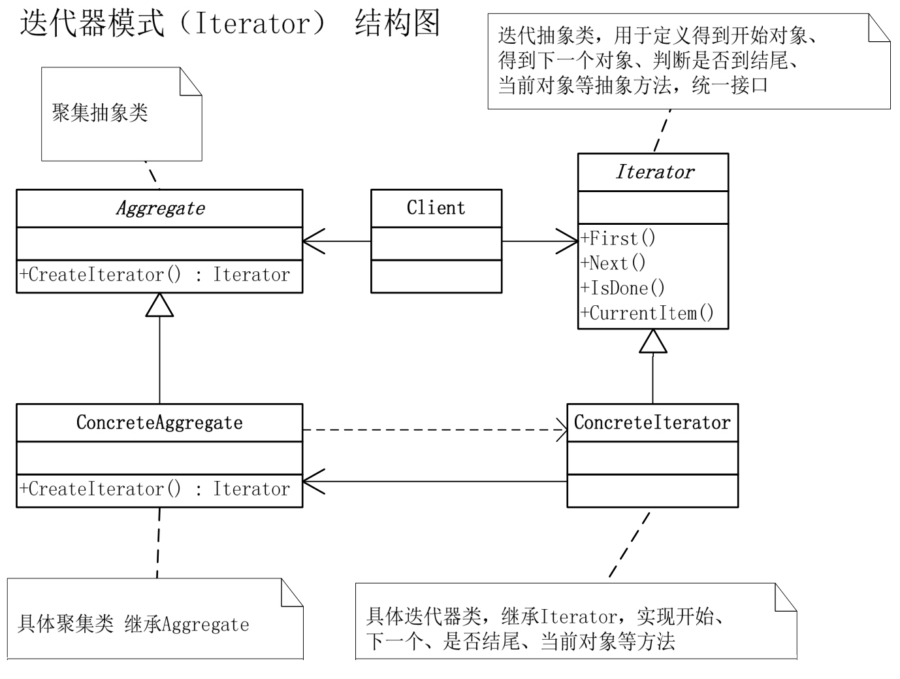

# 迭代器模式

## 模式引入

### 问题描述

实际生活中，我们经常遇到需要遍历一系列聚集对象的情况，比如排队买票，音乐播放列表等。当我们遍历这些对象时，由于它们本来是一个对象，导致我们不得不直接访问其内部列表。而且，如果我们要遍历另一个的对象时，同样的遍历方法又得重写一遍。

### 模式定义

像这种想要别人访问它的元素，但又不想暴露内部结构的情况，就可以使用迭代器模式。

迭代器模式（Iterator）是提供一种方法顺序访问一个聚集对象中各个元素，而又不暴露该对象的内部表示。

### 问题分析

将对列表的访问和遍历放到一个迭代器对象，迭代器定义访问元素的接口。此时，同样的遍历逻辑只需要实现一次。事实上，由于迭代器模式使用太普遍，大部分高级语言都已经对它进行了封装。

## 模式实现

### 解决方案

- 首先定义抽象聚集对象：`聚集` 类，定义 `创建迭代器` 方法，用于创建一个迭代器。
- 然后定义一个具体聚集对象：`具体聚集` 类，除了重写抽象方法外，还需定义简单的 `获取`、`设置`、`计数` 等方法。
- 定义抽象迭代器对象：`迭代器` 类，一般包括：`第一个`、`下一个`、`是否完成` 和 `当前项目` 几个抽象方法。
- 定义具体迭代器对象：`具体迭代器` 类，重写抽象方法，实现对对象的迭代。

### 代码实现

`聚集` 类：

```java
public abstract class 聚集 {
    public abstract 迭代器 创建迭代器();
}
```

`具体聚集` 类：

```java
public class 具体聚集 extends 聚集 {
    private List<Object> 项目列表 = new ArrayList<>();

    @Override
    public 迭代器 创建迭代器() {
        return new 具体迭代器(this);
    }

    public int 计数() {
        return 项目列表.size();
    }

    public Object 获取(int 索引) {
        return 项目列表.get(索引);
    }

    public void 设置(int 索引, String 值) {
        项目列表.add(索引, 值);
    }
}
```

`迭代器` 类：

```java
public abstract class 迭代器 {
    public abstract Object 第一个();
    public abstract Object 下一个();
    public abstract boolean 是否完成();
    public abstract Object 当前项目();
}
```

`具体迭代器` 类：

```java
public class 具体迭代器 extends 迭代器 {
    private 具体聚集 聚集对象;
    private int 当前位置 = 0;

    public 具体迭代器(具体聚集 聚集对象) {
        this.聚集对象 = 聚集对象;
    }

    @Override
    public Object 第一个() {
        return 聚集对象.获取(0);
    }

    @Override
    public Object 下一个() {
        Object 结果 = null;
        当前位置++;
        if(当前位置 < 聚集对象.计数()) {
            结果 = 聚集对象.获取(当前位置);
        }
        return 结果;
    }

    @Override
    public boolean 是否完成() {
        return 当前位置 >= 聚集对象.计数();
    }

    @Override
    public Object 当前项目() {
        return 聚集对象.获取(当前位置);
    }
}
```

`主类` 方法：

```java
public class 主类 {
    public static void main(String[] args) {
        具体聚集 聚集对象 = new 具体聚集();
        聚集对象.设置(0, "大鸟");
        聚集对象.设置(1,"小菜");
        聚集对象.设置(2,"行李");
        聚集对象.设置(3,"老外");
        聚集对象.设置(4,"公交内部员工");
        聚集对象.设置(5,"小偷");

        迭代器 迭代器对象 = new 具体迭代器(聚集对象);

        while (!迭代器对象.是否完成()){
            System.out.println(迭代器对象.当前项目() + " 请买车票");
            迭代器对象.下一个();
        }
    }
}
```

执行结果：

```bash
大鸟 请买车票
小菜 请买车票
行李 请买车票
老外 请买车票
公交内部员工 请买车票
小偷 请买车票
```

### 结构组成



- 聚集抽象类（聚集）。
- 具体聚集类（具体聚集）。
- 迭代抽象类（迭代器）：用于定义各种行为的抽象方法，统一接口。
- 具体迭代器类（具体迭代器）：继承 迭代器，实现具体行为的方法。

## 模式评价

### 适用场景

- 当需要遍历访问一个聚集对象，而且不管这些对象是什么。
- 内部结构复杂，只提供精简的访问方式。
- 对聚集对象支持多种方式遍历。

### 实际应用

- 列表、队列等容器。
- 字符串序列。

### 优点缺点

迭代器模式优点包括：

- 减少重复遍历代码。
- 存储与遍历分离。
- 简化数据访问方式。

迭代器模式缺点包括：

- 过于简单的集合会增加复杂性。
- 增加新的聚集类时可能需要新的迭代器。