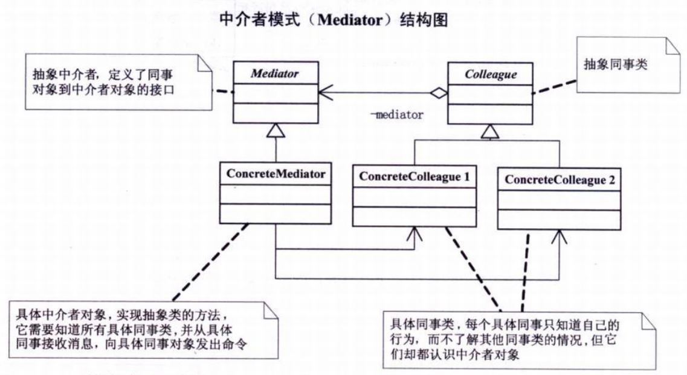

# 中介者模式

## 模式引入

### 问题描述

刚进公司的新人需求其他部门同事帮忙是有困难的，但是通过主管协调就会简单许多。

### **模式定义**

用一个中介对象来封装一系列的对象交互。中介者使各对象不需要显式地相互引用，从而使其耦合松散，而且可以独立地改变它们的交互。

### 问题分析

将系统分割成许多对象通常可以增加其复用性，但是对象之间大量的连接又使得对象之间的耦合性更强，导致对系统的行为进行较大的改动就比较困难。

## 模式实现

### 解决方案

通过中介者对象，可以将系统的网状结构变成以中介者为中心的星型结构，使得对象之间的耦合度变低、扩展性增强，系统的结构不会因为新对象的引入造成大量的修改工作。

Mediator（抽象中介者类）：定义了同事对象到中介者对象的接口。

ConcreteMediator（具体中介者对象）：实现抽象类的方法，知道所有具体同事类，并从具体同事接受消息，向其他具体同事发送命令。

Colleague（抽象同事类）：用于定义抽象的同事对象，

ConcreteColleague（具体同事类）：每个具体同事只知道自己的行为，而不了解其他同事类的情况，但是他们认识终结者对象。

### 代码实现

`中介者` 类：

```java
abstract class 中介者 {
    //定义一个抽象的发送消息方法，得到同事对象和发送消息
    public abstract void 发送消息(String 消息内容,同事 同事对象);
}
```

`具体中介者` 类：

```java
public class 具体中介者 extends 中介者{
    public 具体同事1 具体同事1;
    public 具体同事2 具体同事2;

    public void 设置同事1(具体同事1 同事对象){
        this.具体同事1 = 同事对象;
    }
    public void 设置同事2(具体同事2 同事对象){
        this.具体同事2 = 同事对象;
    }
    @Override
    public void 发送消息(String 消息内容, 同事 同事对象) {
        if(同事对象 == 具体同事1){
            具体同事2.通知(消息内容);
        }else{
            具体同事1.通知(消息内容);
        }
    }
}
```

`同事` 类：

```java
public class 同事 {
    protected 中介者 中介者对象;
    // 构建方法，得到中介者对象
    public 同事(中介者 中介者对象){
        this.中介者对象 = 中介者对象;
    }
}
```

`具体同事` 类：

```java
public class 具体同事1 extends 同事 {
    public 具体同事1(中介者 中介者对象) {
        super(中介者对象);
    }
    public void 发送消息(String 消息内容){
        this.中介者对象.发送消息(消息内容,this);
    }
    public void 通知(String 消息内容){
        System.out.println("同事1得到信息:"+消息内容);
    }
}

public class 具体同事2 extends 同事 {
    public 具体同事2(中介者 中介者对象)
    {
        super(中介者对象);
    }
    public void 发送消息(String 消息内容)
    {
        this.中介者对象.发送消息(消息内容,this);
    }
    public void 通知(String 消息内容)
    {
        System.out.println("同事2得到信息:"+消息内容);
    }
}
```

`主类` 方法：

```java
public class 主类 {
    public static void main(String[] args){
        具体中介者 中介者对象 =new 具体中介者();
        具体同事1 同事对象1 = new 具体同事1(中介者对象);
        具体同事2 同事对象2 = new 具体同事2(中介者对象);
        中介者对象.设置同事1(同事对象1);
        中介者对象.设置同事2(同事对象2);
        同事对象1.发送消息("吃过饭了吗？");
        同事对象2.发送消息("没有呢，你打算请客？");
    }
}
```

执行结果：

```bash
同事2得到信息:吃过饭了吗？
同事1得到信息:没有呢，你打算请客？
```

### 结构组成



## 模式评价

### 适合场景

中介者模式一般应用于一组对象以定义良好但是复杂的方式进行通信的场合。以及想定制一个分布在多个类中的行为，而又不想生成太多的子类的场合。

### 实际应用

nginx_http_upstream_module里定义的upstream框架就是中介者模式（同时也应用了模板模式），它协调load-balance模块和upstream模块共同工作，获取上游服务器的地址，然后转发下游的请求和上游的响应数据。

### 优点缺点

模式优点：

- 中介者减少了各个业务类的耦合，使得可以独立的改变和复用各个业务类和中介者类。
- 中介者的实现类控制了集中化，把对象群交互的复杂性变为中介者的复杂性。
- 当系统出现多对多交互复杂的对象群，可以考虑使用中介这模式。

模式缺点：

- 中介者对象会较为复杂。