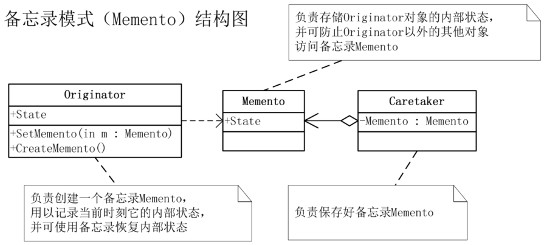

# 备忘录模式

<div class="side-by-side-container">
<div class="side-by-side-panel">
<div class="side-by-side-header">📖 原文</div>
<div class="side-by-side-content">

## 模式引入

### 问题描述

如果我们玩过 RPG 游戏，就知道在关键时点需要进行存档，否则一不小心就可能给出「大侠，请重新来过」的提示，这就需要有一个存档功能。考虑最简单的实现，直接用一个队列或字典将对应时点的状态存起来就行了，当需要恢复某个历史状态时，将对应的状态取出，更新到当前状态。但是这个「保存」和「恢复」在写程序时会有一些问题，大部分的面向对象语言都不允许对私有成员进行外部访问，这有益于程序的健壮。

### 模式定义

像刚刚这种情况，当公共接口无法从外部获取一个对象的内部状态，但我们又需要访问和处理它的内部状态，此时可以使用备忘录模式。

备忘录模式（Memento）是在不破坏封装性的前提下，捕获一个对象的内部状态，并在该对象之外保存这个状态，这样以后就可以将该对象恢复到原先保存的状态。

### 问题分析

让我们用备忘录模式实现问题中的存档，备忘录（存档）用来存储游戏进行到某个时间点的角色状态。当保存状态时，玩家发起一个备忘角色当前时间点的状态到备忘录（存档）；恢复状态时，将该时间点的备忘录（存档）恢复到游戏。

## 模式实现

### 解决方案

- 首先需要定义一个游戏角色 `游戏角色`，并定义角色方法。当然，最主要要的是保存状态 `保存状态` 和恢复状态 `恢复状态` 方法。
- 然后是游戏角色存档 `角色状态备忘录`，里面存有角色在存档时间点的所有状态。
- 最后是角色状态管理者 `角色状态管理者`，用来设置或获取对应的存档。

### 代码实现

`发起人` 类：

```java
public class 游戏角色 {
    // 生命力
    private int 体力;
    // 攻击力
    private int 攻击力;
    // 防御力
    private int 防御力;

    public int 获取体力() {
        return 体力;
    }
    public void 设置体力(int 体力) {
        this.体力 = 体力;
    }

    public int 获取攻击力() {
        return 攻击力;
    }

    public void 设置攻击力(int 攻击力) {
        this.攻击力 = 攻击力;
    }

    public int 获取防御力() {
        return 防御力;
    }

    public void 设置防御力(int 防御力) {
        this.防御力 = 防御力;
    }

    // 状态显示
    public void 状态显示() {
        System.out.println("当前角色状态：");
        System.out.println("体力：" + this.体力);
        System.out.println("攻击力：" + this.攻击力);
        System.out.println("防御力：" + this.防御力);
        System.out.println();
    }

    // 获得初始状态
    public void 获取初始状态() {
        this.体力 = 100;
        this.攻击力 = 100;
        this.防御力 = 100;
    }

    // 战斗
    public void 战斗() {
        this.体力 = 0;
        this.攻击力 = 0;
        this.防御力 = 0;
    }

    // 保存游戏状态
    public 角色状态备忘录 保存状态() {
        return new 角色状态备忘录(体力, 攻击力, 防御力);
    }

    // 恢复角色状态
    public void 恢复状态(角色状态备忘录 备忘录) {
        this.体力 = 备忘录.获取体力();
        this.攻击力 = 备忘录.获取攻击力();
        this.防御力 = 备忘录.获取防御力();
    }
}
```

`备忘录` 类：

```java
public class 角色状态备忘录 {
    private int 体力;
    private int 攻击力;
    private int 防御力;

    public int 获取体力() {
        return 体力;
    }

    public void 设置体力(int 体力) {
        this.体力 = 体力;
    }

    public int 获取攻击力() {
        return 攻击力;
    }

    public void 设置攻击力(int 攻击力) {
        this.攻击力 = 攻击力;
    }

    public int 获取防御力() {
        return 防御力;
    }

    public void 设置防御力(int 防御力) {
        this.防御力 = 防御力;
    }

    public 角色状态备忘录(int 体力, int 攻击力, int 防御力) {
        this.体力 = 体力;
        this.攻击力 = 攻击力;
        this.防御力 = 防御力;
    }

    public 角色状态备忘录() {}
}
```

`管理者` 类：

```java
public class 角色状态管理者 {
    private 角色状态备忘录 备忘录;

    public 角色状态备忘录 获取备忘录() {
        return 备忘录;
    }

    public void 设置备忘录(角色状态备忘录 备忘录) {
        this.备忘录 = 备忘录;
    }
}
```

`Main` 方法：

```java
public class 主类 {
    public static void main(String[] args) {
        // 大战Boss前
        游戏角色 李逍遥 = new 游戏角色();
        李逍遥.获取初始状态();
        李逍遥.状态显示();

        // 保存进度
        角色状态管理者 状态管理员 = new 角色状态管理者();
        状态管理员.设置备忘录(李逍遥.保存状态());

        // 大战Boss时，损耗严重
        李逍遥.战斗();
        李逍遥.状态显示();

        // 恢复之前状态
        李逍遥.恢复状态(状态管理员.获取备忘录());
        李逍遥.状态显示();
    }
}
```

执行结果：

```bash
当前角色状态：
体力：100
攻击力：100
防御力：100

当前角色状态：
体力：0
攻击力：0
防御力：0

当前角色状态：
体力：100
攻击力：100
防御力：100
```

### 结构组成



- 发起人（发起人）：负责创建一个备忘录 备忘录，用以记录当前时刻它的内部状态，并可使用备忘录恢复内部状态。发起人 可根据需要决定 备忘录 存储 发起人 的哪些内部状态。
- 备忘录（备忘录）：负责存储 发起人 对象的内部状态，并可防止 发起人 以外的其他对象访问备忘录 备忘录。备忘录有两个接口，管理者 只能看到备忘录的窄接口，它只能将备忘录传递给其他对象。发起人 能够看到一个宽接口，允许它访问返回到先前状态所需的所有数据。
- 管理者（管理者）：负责保存好备忘录 备忘录，不能对备忘录的内容进行操作或检查。

## 模式评价

### 适用场景

- 必须保存某一时刻的状态以便需要时恢复时。
- 需要回滚、撤销等功能时。

### 实际应用

- 游戏副本存储。
- 编辑器的撤销操作。
- 数据库回滚、操作系统恢复等。

### 优点缺点

备忘录模式优点包括：

- 可以恢复到任意历史状态。
- 保持封装边界。

备忘录模式缺点包括：

- 状态数据很大时可能非常消耗资源。尤其是编辑器，如果一直不间断保存所有编辑记录，最终一篇稿子形成时将会消耗非常庞大的资源。
</div>
</div>

<div class="side-by-side-panel">
<div class="side-by-side-header">💡 解读</div>
<div class="side-by-side-content">

备忘录模式就像游戏中的存档功能。想象你在玩 RPG 游戏时，在打 Boss 前先保存游戏进度，如果不小心挂了，可以读取存档重新开始，而不是从头玩起。

在编程中，备忘录模式就是在不破坏对象封装性的前提下，将对象的内部状态保存下来，以便后续可以恢复到之前的状态。

## 技术深入解析

### 核心角色

1. **发起人(Originator)**：需要保存状态的对象（如游戏角色）
2. **备忘录(Memento)**：存储发起人内部状态的对象（如存档文件）
3. **管理者(Caretaker)**：负责保存和管理备忘录的对象（如存档管理器）

### 代码实现分析

以游戏角色为例：

```java
// 发起人 - 游戏角色
public class 游戏角色 {
    private int 体力;
    private int 攻击力;
    private int 防御力;

    // 保存当前状态到备忘录
    public 角色状态备忘录 保存状态() {
        return new 角色状态备忘录(体力, 攻击力, 防御力);
    }

    // 从备忘录恢复状态
    public void 恢复状态(角色状态备忘录 备忘录) {
        this.体力 = 备忘录.获取体力();
        this.攻击力 = 备忘录.获取攻击力();
        this.防御力 = 备忘录.获取防御力();
    }
}

// 备忘录 - 角色状态存档
public class 角色状态备忘录 {
    private int 体力;
    private int 攻击力;
    private int 防御力;
    // 构造方法和getter/setter
}

// 管理者 - 存档管理器
public class 角色状态管理者 {
    private 角色状态备忘录 备忘录;
    // getter/setter
}
```

### 工作流程

1. 游戏角色初始化状态（体力 100，攻击力 100，防御力 100）
2. 创建存档管理器
3. 角色调用`保存状态()`方法创建备忘录（存档）
4. 存档管理器保存这个备忘录
5. 角色战斗后状态改变（体力 0，攻击力 0，防御力 0）
6. 从存档管理器获取备忘录
7. 角色调用`恢复状态()`方法恢复之前的状态

## 架构师视角的深入思考

### 设计考量

1. **封装性保护**：备忘录模式巧妙地解决了对象状态保存与封装性的矛盾。备忘录对象可以访问发起人的私有状态，但外部对象只能通过受限接口访问备忘录。

2. **状态粒度**：作为架构师需要考虑保存哪些状态。全量保存简单但可能浪费资源，增量保存复杂但高效。

3. **生命周期管理**：管理者需要决定保存多少历史状态，何时清理旧状态。

### 实际应用场景

1. **游戏开发**：不仅是角色状态，整个游戏场景的状态保存
2. **文本编辑器**：撤销/重做功能
3. **事务系统**：数据库事务回滚
4. **配置管理**：系统配置的版本控制

### 性能考量

备忘录模式可能带来以下性能问题：

- 大对象的状态保存消耗内存
- 频繁保存状态影响性能
- 状态序列化/反序列化开销

解决方案：

- 使用增量保存
- 实现懒加载
- 定期清理旧状态
- 使用外部存储（如数据库）保存不常用的状态

## 与其他模式的关系

- **与命令模式**：命令模式常使用备忘录来实现撤销操作
- **与原型模式**：都可以用于保存对象状态，但原型模式是通过克隆整个对象
- **与状态模式**：状态模式关注对象行为随状态变化，备忘录关注状态保存

## 系统架构中的应用

在分布式系统中，备忘录模式可以用于：

- 实现分布式事务的补偿机制
- 系统故障恢复
- 集群节点的状态同步
- 微服务架构中的 Saga 模式实现

## 备考建议

对于软考高级系统架构师考试，重点掌握：

1. 备忘录模式的 UML 类图绘制
2. 模式适用场景的判断
3. 与其他设计模式的对比
4. 在实际系统设计中的应用方案
5. 性能优化方面的考虑

理解备忘录模式不仅有助于通过考试，更能提升你在实际系统架构设计中处理状态管理的专业能力。

</div>
</div>
</div>
