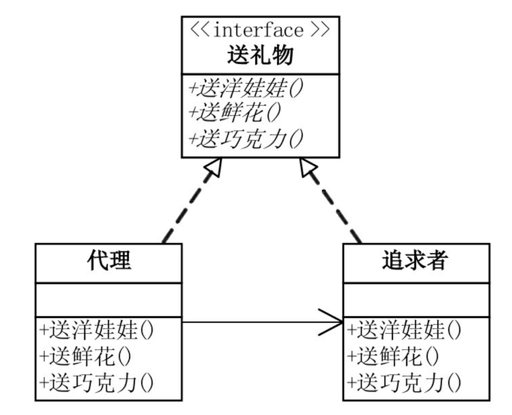
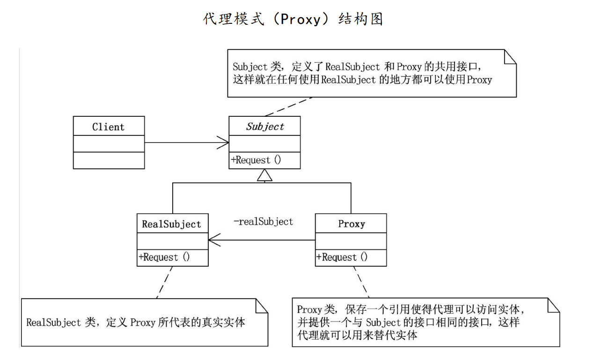

# 代理模式

<div class="side-by-side-container">
<div class="side-by-side-panel">
<div class="side-by-side-header">📖 原文</div>
<div class="side-by-side-content">

## 问题引入

### 问题描述

隔壁班的卓贾易想追求娇娇，但是他自己不好意思，就委托和娇娇同班的戴励帮助他。卓贾易给娇娇先后买了芭比娃娃、花、巧克力，饼委托戴励送给娇娇，却没想给娇娇和戴励创造了相处的机会。娇娇和戴励通过接触互生情愫，最后在一起了。卓贾易自然是很生气，一番追求却为他人做了嫁衣。但细细想来，虽说一直是卓贾易给娇娇买的礼物，但娇娇自始至终都是从戴励手里拿到的礼物，她并未接触过送礼之人——卓贾易。

现在我们想用程序来描述这一个故事，关键之处在于准确描述卓贾易、戴励及娇娇三者之间的行动关系。如果我们只描述了追求者卓贾易，和被追求者娇娇，则与实际情况不符，因为娇娇并不认识卓贾易；而若我们只描述了代理戴励，和被追求者娇娇，亦与实际情况不符，因为礼物是卓贾易买的，戴励并没有礼物直接送给娇娇。为了准确描述他们三人的关系，我们可以考虑使用`代理模式`。

### 模式定义

`代理模式（Proxy Pattern）`是指实现一个类代表另一个类的功能，为其他对象提供一种代理以控制对这个对象的访问。

### 问题分析

`代理模式（Proxy Pattern）`可以应用到这一问题中。

这一问题中有三个类型的角色，追求者（卓贾易），代理（戴励）和被追求者（娇娇）。他们三者间的关系满足，追求者（卓贾易）委托代理（戴励），通过代理（戴励）给被追求者（娇娇）送礼物，而被追求者（娇娇）只与代理（戴励）有接触。

若使用代理模式描述，即代理（戴励）代表了追求者（卓贾易）的追求（赠送礼物）的功能，被追求者（娇娇）仅与代理（戴励）接触便收到了礼物。这样就实现了他们三人关系的准确描述。

## 模式实现

### 解决方案

使用`代理模式`来解决这一问题。

1. 创建送礼物的抽象类`IGiveGift`，定义追求者和代理的共用接口：
   - 送玩具方法`GiveDolls()`;
   - 送花方法`GiveFlowers()`;
   - 送巧克力方法`GiveChocolate()`。
2. 创建追求者`Pursuit`，定义需要代理的真正实体，继承于抽象类`IGiveGift`:
   - 覆写类初始化方法，记录被追求者姓名；
   - 覆写送玩具、送花、送巧克力方法，具体送礼操作。
3. 创建代理`Proxy`，保存追求者实体的一个引用，使得代理可以访问实体，继承于抽象类`IGiveGift`，实现对实体的替代：
   - 覆写类初始化方法，初始化的同时初始化一个追求者`Pursuit`对象；
   - 覆写送玩具、送花、送巧克力方法，在每一个送礼方法下调用追求者`Pursuit`的具体送礼操作

### 代码实现

_此处我们使用 Java 语言来实现这一方案，C#语言实现可见原书原版，本项目的所有语言实现可见本项目 Github 仓库，其中包括：[C++](https://github.com/datawhalechina/sweetalk-design-pattern/tree/main/src/design_patterns/cpp/proxy/)，[Java](https://github.com/datawhalechina/sweetalk-design-pattern/tree/main/src/design_patterns/java/proxy/example)，[python](https://github.com/datawhalechina/sweetalk-design-pattern/tree/main/src/design_patterns/python/proxy/Proxy.py)，读者可按需参阅。_

首先定义一个被追求者类，是为了使故事可以完整描述，无需实现特别的功能。

```Java
public class 女学生 {
    private String 姓名;

    public 女学生() {}

    public 女学生(String 姓名) {
        this.姓名 = 姓名;
    }

    public String 获取姓名() {
        return 姓名;
    }

    public void 设置姓名(String 姓名) {
        this.姓名 = 姓名;
    }
}
```

定义送礼物的抽象类`送礼物`。

```java
public interface 送礼物 {
    public void 送玩具();
    public void 送花();
    public void 送巧克力();
}
```

追求者类增加了实现送礼物的接口的改动。

```Java
public class 追求者 implements 送礼物{
    女学生 美眉 ;

    public 追求者(女学生 美眉) {
        this.美眉 = 美眉;
    }

    public void 送玩具() {
        System.out.println(美眉.获取姓名() + " give you a doll");
    }

    public void 送花() {
        System.out.println(美眉.获取姓名() + " give you a Flower");
    }

    public void 送巧克力() {
        System.out.println(美眉.获取姓名() + " give you a chocolate");
    }
}
```

代理类，是唯一即认识追求者，又认识被追求者的类。初始化时与追求者及被追求者建立关联，实现送礼物方法时调用追求者的同名方法。

```Java
public class 代理 implements 送礼物 {
    追求者 哥哥;

    public 代理(女学生 美眉) {
        this.哥哥 = new 追求者(美眉);
    }

    public void 送玩具() {
        哥哥.送玩具();
    }

    public void 送花() {
        哥哥.送花();
    }

    public void 送巧克力() {
        哥哥.送巧克力();
    }
}
```

客户端如下。

```java
public class 代理客户端 {
    public static void main(String[] args) {
        女学生 娇娇 = new 女学生();
        娇娇.设置姓名("JiaoJiao Li");

        代理 代理对象 = new 代理(娇娇);

        代理对象.送玩具();
        代理对象.送花();
        代理对象.送巧克力();
    }
}
```

运行结果如下。

```
JiaoJiao Li give you a doll
JiaoJiao Li give you a Flower
JiaoJiao Li give you a chocolate
```

### 结构组成

代理模式由三个主要角色组成：

1.  访问接口：在这个例子中具体为送礼物的行为；
2.  实体类：在这个例子中具体为追求者；
3.  替代实体的代理类：在这个例子中具体为代理。

结构图如下：



代理模式的通用结构示意图如下



## 模式评价

### 适用场景

不方便直接访问对象时，为不宜直接访问的对象提供一个访问层。

使用代理模式的方式分为以下几种：

- 本地执行远程服务（远程代理）：适用于服务对象位于远程服务器上的情形，可以为一个对象在不同的地址空间提供局部代表。
- 延迟初始化（虚拟代理）：如果你有一个偶尔使用的重量级服务对象，一直保持该对象运行会消耗系统资源时，可使用代理模式。
- 访问控制（保护代理/安全代理）：如果只希望特定客户端使用服务对象，对象可以是操作系统中的重要部分，而客户端则是各种已启动程序，可使用代理模式。
- 记录日志请求（日志记录代理）：适用于需要保存对于服务对象的请求历史记录时。
- 缓存请求结果（缓存代理）：适用于需要缓存客户请求结果并对缓存生命周期进行管理时，特别是返回结果体积非常大时。
- 智能指引：调用真实对象时，代理处理另外一些事，可在没有客户端使用某个重量级对象时，立刻销毁该对象。

### 实际应用

- 信用卡是银行账户的代理，而银行账户则是一大捆现金的代理。它们都可以实现相同的支付功能。
- windows 里的快捷方式。
- 客户端对数据库的查询有时要消耗大量系统资源，常在有需要时才创建（延迟初始化），这会带来代码的大量重复。可以创建代理，让代理伪装成数据库对象，在客户端或实际数据库对象不知情的情况下处理延迟初始化和缓存查询结果的工作。

### 优点缺点

模式优点包括：

- 引入代理后，职责清晰；
- 引入代理后，可扩展多种用途，如：
  - 远程代理可以隐藏一个对象存在于不同地址空间的事实。
  - 虚拟代理可以存放实例化时间很长的真实对象。
- 符合“开放封闭原则”，无需对服务器或客户端进行修改就创建新的代理。

模式缺点包括：

- 代码可能变得复杂，因为需要新建许多类；
- 服务响应可能会延迟。

## 参考资料

1. 《深入设计模式》

</div>
</div>
  
<div class="side-by-side-panel">
<div class="side-by-side-header">💡 解读</div>
<div class="side-by-side-content">
# 代理模式详解：从卓贾易追娇娇的故事到系统架构设计

## 通俗理解代理模式

这个追求故事生动地展示了代理模式的核心思想：卓贾易（真实对象）想追求娇娇（目标对象），但通过戴励（代理）来间接实现送礼物的行为。在软件设计中，代理模式就是为一个对象提供一个替身或占位符，以控制对这个对象的访问。

## 技术深入解析

### 1. 代理模式的三大角色

1. **抽象主题（IGiveGift/送礼物）**：定义真实主题和代理主题的共同接口
2. **真实主题（Pursuit/追求者）**：真正执行业务逻辑的对象
3. **代理（Proxy/代理）**：持有真实主题的引用，控制对真实主题的访问

### 2. 代理模式的实现机制

在代码实现中，我们看到：

```java
// 代理类
public class 代理 implements 送礼物 {
    追求者 哥哥; // 持有真实主题的引用

    public 代理(女学生 美眉) {
        this.哥哥 = new 追求者(美眉); // 初始化时创建真实主题
    }

    public void 送玩具() {
        哥哥.送玩具(); // 调用真实主题的方法
    }
    // 其他方法类似...
}
```

这种结构实现了对真实对象的访问控制，客户端只与代理交互，不知道真实对象的存在。

### 3. 代理模式的变体

在实际系统架构中，代理模式有多种变体：

1. **远程代理**：为位于不同地址空间的对象提供本地代表（如 RPC 调用）
2. **虚拟代理**：延迟创建开销大的对象（如图片懒加载）
3. **保护代理**：控制对原始对象的访问权限（如权限验证）
4. **智能引用**：在访问对象时执行额外操作（如引用计数、对象锁定）

## 系统架构中的应用场景

### 1. 分布式系统中的应用

在微服务架构中，客户端代理（如 Feign 客户端）就是典型的代理模式应用。客户端不需要知道服务实例的具体位置，通过代理来完成远程调用。

```java
// 声明式REST客户端
@FeignClient(name = "user-service")
public interface UserServiceProxy {
    @GetMapping("/users/{id}")
    User getUser(@PathVariable("id") Long id);
}
```

### 2. 延迟加载与缓存

ORM 框架（如 Hibernate）中的延迟加载就是通过代理实现的：

```java
// 实体类
@Entity
public class Order {
    @OneToMany(fetch = FetchType.LAZY)
    private List<OrderItem> items; // 实际是代理对象
}
```

### 3. 访问控制与安全

Spring Security 中的方法级安全就是通过代理实现的：

```java
@Service
public class BankService {
    @PreAuthorize("hasRole('ADMIN')")
    public void transferMoney() {
        // 只有管理员能执行
    }
}
```

## 架构设计中的考量

### 优点

1. **职责清晰**：代理对象处理访问控制，真实对象专注业务逻辑
2. **高扩展性**：可以方便地添加日志、缓存、权限等功能
3. **降低耦合**：客户端与真实对象解耦
4. **保护真实对象**：避免直接暴露敏感对象

### 缺点

1. **性能开销**：增加了一层间接调用
2. **复杂度增加**：需要额外设计和维护代理类
3. **响应延迟**：特别是远程代理可能有网络延迟

## 备考重点

1. **UML 类图绘制**：能准确画出代理模式的类图，包括 Subject、RealSubject 和 Proxy 三个角色
2. **应用场景识别**：能识别哪些场景适合使用代理模式
3. **变体区分**：能区分不同类型的代理模式及其适用场景
4. **优缺点分析**：能全面分析代理模式的优缺点
5. **代码实现**：能用任一编程语言实现代理模式

## 真题演练

假设考题为："在电商系统中，商品图片加载需要实现延迟加载功能，请说明如何应用设计模式解决这个问题？"

回答要点：

1. 识别这是虚拟代理的应用场景
2. 设计图片代理类，在真正需要显示时才加载真实图片
3. 代理类与真实图片类实现相同接口
4. 客户端通过代理访问图片，不影响现有代码结构
5. 分析这种设计的优点（节省内存、提高响应速度）和缺点（首次加载可能有延迟）

通过这样生动的案例和实际的技术解析，希望能帮助你深入理解代理模式在系统架构中的应用和价值。

</div>
</div>
</div>
