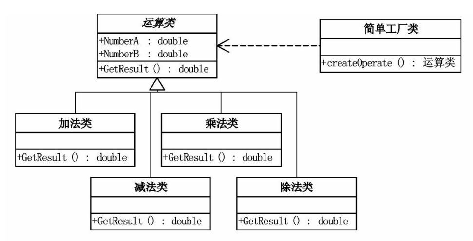

# 简单工厂模式

<div class="side-by-side-container">
<div class="side-by-side-panel">
<div class="side-by-side-header">📖 原文</div>
<div class="side-by-side-content">

## 模式引入

### 问题描述

小菜参加面试，面试要求用面向对象语言实现一个计算器控制台程序，要求输入两个数和运算符号，得到结果。要实现这一程序并不困难，但若未来该程序要增添新的运算符号，而仍想使用这个程序的话，程序应当要设计得耦合性低些，尽量减少增加功能时需要的改动。同时，应该考虑把计算部分独立出来，这样如果未来该 windows 程序迁移到 web 版，计算部分也不需要修改。

### 模式定义

`简单工厂模式（Simple Factory Pattern）`是用一个单独的类来实现具体的实例化过程，避免客户端对具体实例化过程的显式指定。

### 问题分析

`简单工厂模式`可以用于这个问题。将加减乘除等运算类独立实现，并创建工厂类维护对运算类的使用。之后若需要增加新的运算符号，则只需增加运算类，修改工厂类即可，这也同时降低修改后的重复编译量（松耦合）。此外，简单工厂模式降了低业务逻辑和界面逻辑的耦合，易于复用（不是复制），若未来该 windows 程序迁移到 web 版，业务部分（计算部分）不需要修改。

## 模式实现

### 解决方案

使用`简单工厂模式`来解决问题。

1. 首先定义一个抽象的运算类`Operation`，定义抽象类的同时定义其所有子类的公共接口，并定义一个方法`getResult(numberA,numberB)`用于得到结果；
2. 分别创造具体的加减乘除运算类，都为抽象运算类的子类，则具体运算类之中若有一者需要修改，不会影响其它的运算类。覆写具体运算类中`getResult(numberA,numberB)`方法实现运算操作；
3. 创建简单工厂类`OperationFactory`，根据输入参数，使用条件判断调用具体的运算类，实现业务逻辑和界面逻辑的分离。

### 代码实现

_此处我们使用 Java 语言来实现这一方案，C#语言实现可见原书原版，本项目的所有语言实现可见本项目 Github 仓库，其中包括：[C++](https://github.com/datawhalechina/sweetalk-design-pattern/tree/main/src/design_patterns/cpp/simple_factory/)，[Java](https://github.com/datawhalechina/sweetalk-design-pattern/tree/main/src/design_patterns/java/simple_factory//)，[python](https://github.com/datawhalechina/sweetalk-design-pattern/tree/main/src/design_patterns/python/simple_factory/SimpleFactory.py)，读者可按需参阅。_

首先定义一个抽象运算类。

```Java
public abstract class 运算类 {
    public double 数字A;
    public double 数字B;

    public abstract double 获取结果();
}
```

定义加减乘除等运算类。

```Java
public class 加法运算 extends 运算类 {
    @Override
    public double 获取结果() {
        return 数字A + 数字B;
    }
}

public class 减法运算 extends 运算类 {
    @Override
    public double 获取结果() {
        return 数字A - 数字B;
    }
}

public class 乘法运算 extends 运算类 {
    @Override
    public double 获取结果() {
        return 数字A * 数字B;
    }
}

public class 除法运算 extends 运算类 {
    @Override
    public double 获取结果() {
        if(数字B == 0){
            throw new RuntimeException("除数不能为0。");
        }
        return 数字A / 数字B;
    }
}
```

简单运算工厂类维护创造运算实例的过程。

```Java
public class 运算工厂 {
    public static 运算类 创建运算(char 运算符) {
        运算类 运算对象 = null;

        switch (运算符) {
            case '+':
                运算对象 = new 加法运算();
                break;
            case '-':
                运算对象 = new 减法运算();
                break;
            case '*':
                运算对象 = new 乘法运算();
                break;
            case '/':
                运算对象 = new 除法运算();
                break;
        }
        return 运算对象;
    }
}
```

客户端如下。

```Java
public class 计算器 {
    public static void main(String[] args) {
        运算类 运算对象;
        char 运算符;

        运算符 = '+';
        运算对象 = 运算工厂.创建运算(运算符);
        运算对象.数字A = 1;
        运算对象.数字B = 2;

        System.out.println(运算对象.获取结果());
    }
}
```

运行结果如下。

```
3
```

### 结构组成

简单工厂模式由三类主要角色组成：

1.  抽象类：定义所有支持算法的公共接口，在这个例子中具体运算抽象类；
2.  具体算法类：具体的算法，在这个例子中具体为加减乘除运算类；
3.  简单工厂类：维护对运算类的应用。

以上述问题为例，结构如下



## 模式评价

### 适用场景

将类类比为产品，则使用者可以在不清楚类生产的具体过程的情况下，使用不同的产品。

</div>
</div>
  
<div class="side-by-side-panel">
<div class="side-by-side-header">💡 解读</div>
<div class="side-by-side-content">

想象你是一家汽车制造厂的老板。你有生产轿车、SUV 和卡车的能力。客户不需要知道这些车是怎么制造的，他们只需要告诉销售员"我要一辆 SUV"，销售员就会从工厂里调出一辆 SUV 给客户。

简单工厂模式就是这个道理：**将对象的创建和使用分离**，使用者不需要知道对象的具体创建过程，只需要告诉工厂"我要什么"，工厂就会返回对应的对象。

## 技术深入解析

### 1. 模式本质

简单工厂模式是一种**创建型模式**，它通过一个工厂类来封装对象的创建逻辑，客户端只需要与工厂交互，而无需直接实例化具体类。

### 2. 架构设计价值

从系统架构角度看，简单工厂模式提供了以下关键优势：

1. **解耦**：将对象的创建和使用分离，降低系统耦合度
2. **可维护性**：新增产品类时，只需修改工厂类，不需要修改客户端代码
3. **可扩展性**：易于添加新产品类
4. **复用性**：业务逻辑（计算部分）可以独立于界面逻辑复用

### 3. 计算器案例的架构分析

在计算器案例中：

- **抽象产品**：运算类（定义统一接口）
- **具体产品**：加法运算、减法运算等（实现具体逻辑）
- **工厂**：运算工厂（根据输入参数创建具体运算对象）

这种设计使得：

1. 新增运算（如开平方）只需添加新运算类和修改工厂，不影响现有代码
2. 计算逻辑可以独立于 UI（控制台或 Web）复用
3. 客户端代码简洁，不需要了解具体运算类的实现细节

### 4. 模式实现关键点

```java
// 抽象产品
public abstract class 运算类 {
    public double 数字A;
    public double 数字B;
    public abstract double 获取结果();
}

// 具体产品
public class 加法运算 extends 运算类 {
    @Override
    public double 获取结果() { return 数字A + 数字B; }
}

// 工厂
public class 运算工厂 {
    public static 运算类 创建运算(char 运算符) {
        switch (运算符) {
            case '+': return new 加法运算();
            // 其他运算...
        }
    }
}

// 客户端
运算类 运算对象 = 运算工厂.创建运算('+');
运算对象.数字A = 1;
运算对象.数字B = 2;
System.out.println(运算对象.获取结果());
```

### 5. 架构师视角的优缺点

**优点**：

- 符合单一职责原则（创建逻辑集中管理）
- 符合开闭原则（新增运算不影响现有代码）
- 降低耦合度（客户端只依赖抽象）

**缺点**：

- 工厂类职责过重（所有产品创建逻辑集中一处）
- 不易扩展复杂的产品等级结构
- 增加新产品需要修改工厂类（违反开闭原则）

### 6. 实际应用场景

1. **支付系统**：根据支付方式（支付宝、微信等）创建不同支付处理器
2. **日志系统**：根据配置创建文件日志、数据库日志等不同日志记录器
3. **数据库访问**：根据配置创建 MySQL、Oracle 等不同数据库连接对象

## 备考建议

1. **理解核心**：重点掌握"对象创建和使用分离"的思想
2. **对比学习**：与工厂方法、抽象工厂模式对比记忆
3. **UML 绘图**：熟练绘制简单工厂模式的类图
4. **代码实践**：亲自实现几个简单工厂模式的例子
5. **场景分析**：思考在系统架构中如何应用该模式解耦

记住：简单工厂模式是设计模式中最基础但非常重要的模式，理解它能为学习其他创建型模式打下坚实基础。

</div>
</div>
</div>
