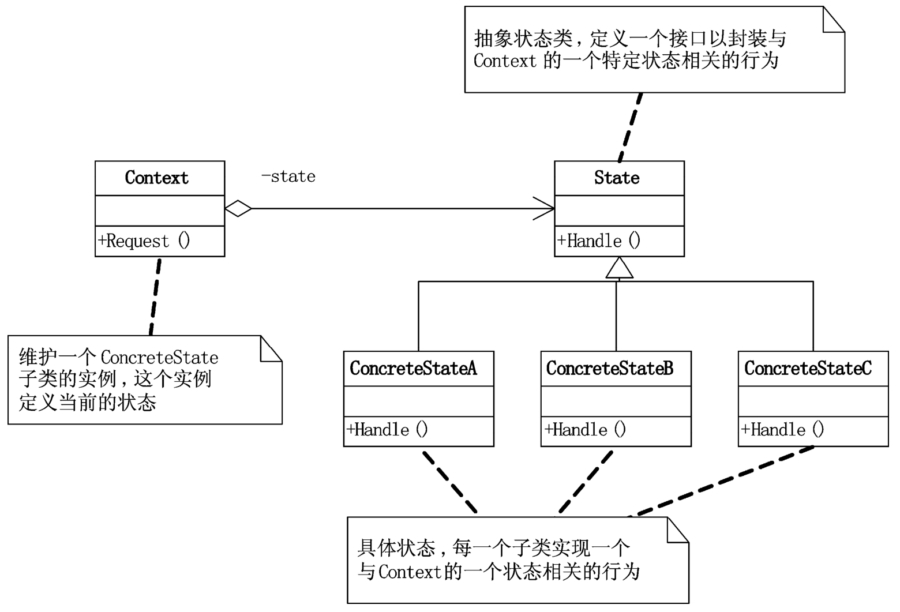

# 状态模式

## 设计动机

**问题引入**

假设我们要描述一名员工一天的工作状态，正常来看是比较简单的，直接从某个状态开始，根据一些条件判断切换到其他状态。但假设我们切换到一个状态后又可能需要根据另外的条件再次切换，比如本来在看论文，突然领导喊开会，那就要切换到开会状态，开完会线上出了个问题，此时又要切换到写代码状态，当然也可能回来继续看论文。这需要各种条件判断（每个状态都要判断是否满足跳到其他状态），不光是写起来复杂，新增状态和更新状态更是会变得异常麻烦。

此时，很自然我们就会想要将一个个状态独立出来，为每个状态设置所有需要的切换条件，在状态发生变化时改变对应的行为。这样我们只需要关心状态从 A 转换到 B，而不用管各种判断逻辑。具体来说，我们可以将看论文、开会、写代码、下班等都设置为一个个状态，每个状态内部有自己的转换判断，比如看论文可以切换到开会、写代码和下班，但不需要切换到看论文，下班也不切换到开会等等。这样每种状态有自己的判断逻辑，行为和状态绑定，外部只需直接切换到想要的状态即可。

**模式引入**

当控制一个对象状态转换的条件表达式过于复杂时，把状态的判断逻辑转移到表示不同状态的一系列类中，可以简化复杂的判断逻辑。如果状态的判断很简单，就不需要使用状态模式了。状态模式将不同状态的行为分割开，将与特定状态相关的行为局部化（放入一个对象），通过新的类很容易新增状态。状态模式通过把各种状态的转移逻辑分不到 State 的子类之间，减少相互依赖，消除庞大的条件分支判断。

## 模式介绍

**模式定义**

状态模式允许一个对象在内部状态改变时改变它的行为，这个对象看起来好像改变了类。

**实现方式**

- 将状态的转换放到具体的状态类内部。
- 通过上下文直接或通过参数改变状态，而不同的状态对应不同的行为。

**模式结构**

**代码实现**

- C++ 实现：[链接](https://github.com/datawhalechina/sweetalk-design-pattern/tree/main/src/design_patterns/cpp/state)
- Java 实现：[链接](https://github.com/datawhalechina/sweetalk-design-pattern/tree/main/src/design_patterns/java/state)
- Python 实现：[链接](https://github.com/datawhalechina/sweetalk-design-pattern/tree/main/src/design_patterns/python/state)

## 使用场景

**适合场景**

- 当一个对象的行为取决于它的状态，并且必须在运行时根据状态改变其行为时。
- 某业务有多个状态，且状态变化依赖大量分支判断时。

**实际应用**

实际中的例子：多个状态与行为变化。

- 有限状态机。
- TCP 连接协议。
- 其他涉及一系列状态变化的应用。

## 模式评价

**模式优点**

- 状态即行为，通过状态的改变引起行为的变化，消除了条件逻辑，代码更简单清晰。
- 与特定状态相关的代码都放在一起，提高了聚合性。
- 添加一个状态非常容易，提高了扩展性。

**不足之处**

- 可能会创建太多功能较为单一的类。
- 新的行为可能涉及大量改动。
- 状态少或很少改变时有点小题大做，此时不应使用状态模式。