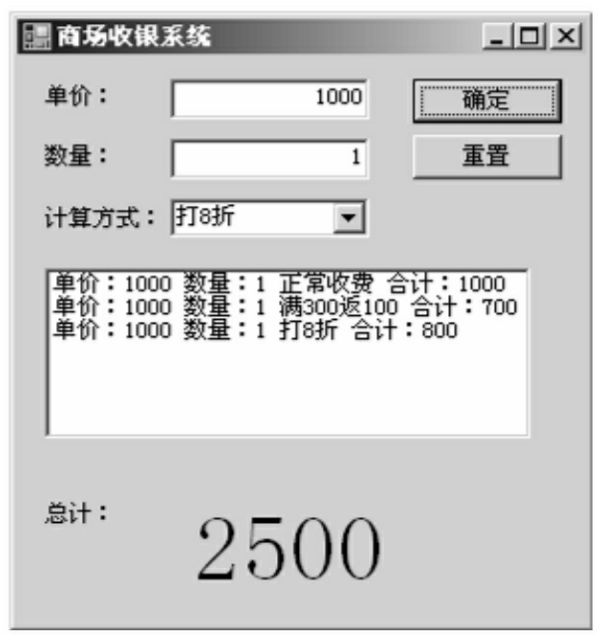
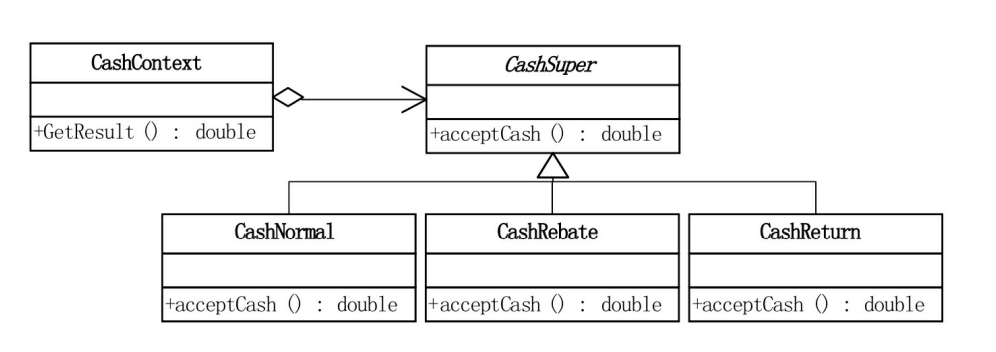
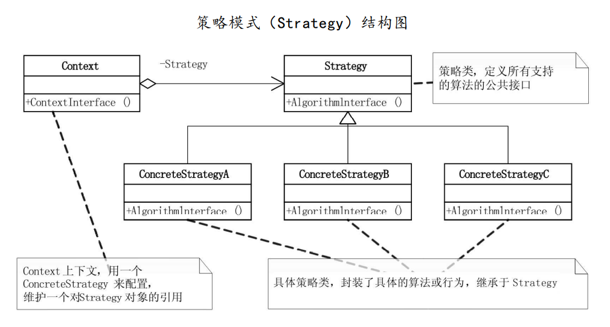

# 策略模式

## 问题引入

### 问题描述

大鸟给小菜出了个作业，要求实现一个商场收银软件程序，营业员可以通过输入客户所有购买商品的单价和数量，程序自动计算出总金额。同时，商场有时会有打折活动（如商品打7折），或满减促销活动（如商品满300-100），程序应能考虑这些活动的情形，在尽量减少重复代码的前提下，实现正确的金额计算。



考虑到商场可能经常性地更改打折额度和返利额度，上述问题虽然可以用简单工厂模式实现，但如果每次扩展收费形式都要改动工厂，导致代码重新编译部署，则确实不是最好的处理方式。此时可以考虑使用`策略模式`。

### 模式定义

`策略模式（Strategy Pattern）`是指定义一个算法家族，使得家族内的不同算法都遵从算法家族的接口及方法规范，从而可以实现算法间互相替换，且不会影响到使用算法的客户。

### 问题分析

`策略模式`可以用于这一问题，因为商场促销活动变化繁多，如打7折，打8折，满300-100，满700-200等，这些促销活动逻辑类似，而且随时可以相互替换，恰符合`策略模式`的应用场景。

## 模式实现

### 解决方案

使用`策略模式`来解决问题。
1. 首先创建抽象的算法类`CashSupur`，作为所有促销活动算法的抽象类，同时定义所有支持算法的公共接口，定义方法`acceptCash()`用于得到结果；
2. 创建具体的促销算法类`CashNormal`，`CashRebate`等，继承于抽象算法类`CashSupur`，覆写`acceptCash()`实现具体的促销算法；
3. 创建上下文类`CashContext`，维护对算法对象的引用，使用时根据用户输入，传入一个具体的促销算法类来配置。

### 代码实现

*此处我们使用Java语言来实现这一方案，C#语言实现可见原书原版，本项目的所有语言实现可见本项目Github仓库，其中包括：[C++](https://github.com/datawhalechina/sweetalk-design-pattern/tree/main/src/design_patterns/cpp/strategy/)，[Java](https://github.com/datawhalechina/sweetalk-design-pattern/tree/main/src/design_patterns/java/strategy/)，[python](https://github.com/datawhalechina/sweetalk-design-pattern/tree/main/src/design_patterns/python/strategy/Strategy.py)，读者可按需参阅。*

首先定义一个收费抽象类。

```Java
public abstract class 收费抽象类{
    public abstract double 接受现金(double 金额);
}
```

定义具体的促销算法类，包括正常收费类`正常收费`，打折收费类`打折收费`，返利收费类`返利收费`。

```Java
public class 正常收费 extends 收费抽象类 {
    @Override
    public double 接受现金(double 金额) {
        return 金额;
    }
}

public class 打折收费 extends 收费抽象类 {
    private double 折扣率;

    public 打折收费(String 折扣率) {
        this.折扣率 = Double.parseDouble(折扣率);
    }

    @Override
    public double 接受现金(double 金额) {
        return 金额 * 折扣率;
    }

    public double 获取折扣率() {
        return 折扣率;
    }
  
    public void 设置折扣率(double 折扣率) {
        this.折扣率 = 折扣率;
    }
}

public class 返利收费 extends 收费抽象类 {
    private double 满额条件;
    private double 返利金额;

    public 返利收费(String 满额条件, String 返利金额) {
        this.满额条件 = Double.parseDouble(满额条件);
        this.返利金额 = Double.parseDouble(返利金额);
    }

    @Override
    public double 接受现金(double 金额) {
        if(金额 >= this.满额条件) {
            return 金额 - Math.floor(金额 / this.满额条件) * 返利金额;
        }
        return 金额;
    }

    public double 获取满额条件() {
        return 满额条件;
    }

    public void 设置满额条件(double 满额条件) {
        this.满额条件 = 满额条件;
    }

    public double 获取返利金额() {
        return 返利金额;
    }

    public void 设置返利金额(double 返利金额) {
        this.返利金额 = 返利金额;
    }
}
```

定义上下文类`收费上下文`，维护对算法对象的引用。

```Java
public class 收费上下文 {

    private 收费抽象类 收费策略;

    public 收费上下文(String 类型) {
        switch(类型){
            case "正常收费":
                this.收费策略 = new 正常收费();
                break;
            case "满返":
                this.收费策略 = new 返利收费("300", "100");
                break;
            case "打折":
                this.收费策略 = new 打折收费("0.8");
                break;
        }
    }

    public double 获取结果(double 金额){
        return 收费策略.接受现金(金额);
    }
}
```

客户端如下。

```Java
public class 收银客户端 {
    public static void main(String[] args) {
        double 数量 = 10;
        double 单价 = 100;

        收费上下文 收费策略1 = new 收费上下文("正常收费");
        收费上下文 收费策略2 = new 收费上下文("满返");
        收费上下文 收费策略3 = new 收费上下文("打折");
        System.out.println(收费策略1.获取结果(单价 * 数量));
        System.out.println(收费策略2.获取结果(单价 * 数量));
        System.out.println(收费策略3.获取结果(单价 * 数量));
    }
}
```

运行结果如下。
```
1000
700
800
```

### 结构组成

策略模式由三类主要角色组成：
 1. 策略类：定义所有支持算法的公共接口，在这个例子中具体为收费抽象类；
 2. 具体策略类：具体的算法，在这个例子中具体为各类收费类和折扣优惠收费类；
 3. 上下文类：维护对策略对象的应用。

结构示意图如下



策略模式通用结构示意图如下



## 模式评价

### 适用场景

一个系统中有多个算法和类很相似，区分这些类和算法的只是其内部行为。

### 实际应用

* 在导航应用中，有不同的路径规划算法，如针对步行的、骑行的、搭乘公共交通工具的、以及开车的等。主要导航类的主要工作是在地图上渲染出规划好的路径，并不会在意是由和算法生成的路径。此时可以将路径规划算法使用策略模式进行封装，方便与主要导航类的交互。

### 优点缺点

策略模式的优点有

* 可以以相同的方式调用所有算法，减少了各种算法类与使用算法类之间的耦合。策略模式的Strategy类层次为Context类定义了一系列的可供重复使用的算法或行为，继承有助于析取这些算法中的公共功能。
* 简化了单元测试。每个算法都有自己的类，可以通过自己的接口单独测试；
* 符合“开放封闭原则”，无需对上下文进行修改就可以引入新的策略。

策略模式的缺点有

* 不适合算法极少发生改变的场景，会使得程序整体过于复杂；
* 要求客户端必须知晓策略间的不同，因为需要从中选择；


## 参考资料
1. 《深入设计模式》