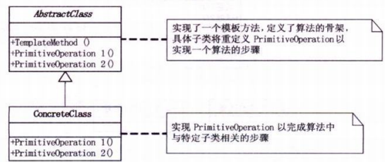

# 模板方法模式

<div class="side-by-side-container">
<div class="side-by-side-panel">
<div class="side-by-side-header">📖 原文</div>
<div class="side-by-side-content">

## 模式引入

### 问题描述

回想小时候的随堂测验，老师在黑板上抄题目，同学们在下面先抄题目，再做答案。经常有同学眼神不好，会把题目抄错。

但是在考试时，就不会出现这种情况。因为大家拿到的考试试卷都是一样的。这里的考试试卷类似于一个模板，提取了相同的部分。

### 模式定义

`模板方法模式`定义了一个操作中的算法的骨架，将一些步骤延迟到子类中。

子类可以按需重写方法实现，但调用将以抽象类中定义的方式进行。

### 问题分析

尽可能减少所有重复的代码。

## 模式介绍

### 解决方案

- 对于不同的学生，只有给出的答案不同，其他内容全都一样；
  - 将所有的重复代码都上升到父类，使其称为子类的**模板** --> 将公共的试题代码写到父类，试题和答案都继承于它；
  - 只将答案改成一个虚方法，给继承的子类重写；
- 在客户端代码中，将子类变量的声明改成父类，利用多态实现代码复用。

### 代码实现

考题试卷的抽象类：

```java
public abstract class 试卷 {
    public void 问题1() {
        System.out.println("杨过得到，后来给了郭靖，炼成倚天剑、屠龙刀的玄铁可能是[ ] a.球墨铸铁 b.马口铁 c.高速合金钢 d.碳素纤维");
        System.out.println("答案：" + 答案1());
    }

    public void 问题2() {
        System.out.println("杨过、程英、陆无双铲除了情花，造成[ ] a.使这种植物不再害人 b.使一种珍稀物种灭绝了 c.破坏了那个生物圈的生态平衡 d.造成该地区沙漠化");
        System.out.println("答案：" + 答案2());
    }

    public void 问题3() {
        System.out.println("蓝凤凰致使华山师徒、桃谷六仙呕吐不止，如果你是大夫，会给他们开什么药[ ] a.阿司匹林 b.牛黄解毒片 c.氟哌酸 d.让他们喝大量的生牛奶 e.以上全不对");
        System.out.println("答案：" + 答案3());
    }

    protected abstract String 答案1();

    protected abstract String 答案2();

    protected abstract String 答案3();
}
```

学生甲抄试卷的具体类：

```java
public class 试卷A extends 试卷 {
    @Override
    protected String 答案1() {
        return "b";
    }

    @Override
    protected String 答案2() {
        return "c";
    }

    @Override
    protected String 答案3() {
        return "a";
    }
}
```

学生乙抄试卷的具体类：

```java
public class 试卷B extends 试卷 {
    @Override
    protected String 答案1() {
        return "c";
    }

    @Override
    protected String 答案2() {
        return "a";
    }

    @Override
    protected String 答案3() {
        return "a";
    }
}
```

客户端代码：

```java
public class 模板方法主类 {
    public static void main(String[] args) {
        System.out.println("学生甲抄的试卷：");
        试卷 学生A = new 试卷A();
        学生A.问题1();
        学生A.问题2();
        学生A.问题3();

        System.out.println("学生乙抄的试卷：");
        试卷 学生B = new 试卷B();
        学生B.问题1();
        学生B.问题2();
        学生B.问题3();
    }
}
```

执行结果：

```bash
学生甲抄的试卷：
杨过得到，后来给了郭靖，炼成倚天剑、屠龙刀的玄铁可能是[ ] a.球墨铸铁 b.马口铁 c.高速合金钢 d.碳素纤维
答案：b
杨过、程英、陆无双铲除了情花，造成[ ] a.使这种植物不再害人 b.使一种珍稀物种灭绝了 c.破坏了那个生物圈的生态平衡 d.造成该地区沙漠化
答案：c
蓝凤凰致使华山师徒、桃谷六仙呕吐不止，如果你是大夫，会给他们开什么药[ ] a.阿司匹林 b.牛黄解毒片 c.氟哌酸 d.让他们喝大量的生牛奶 e.以上全不对
答案：a
学生乙抄的试卷：
杨过得到，后来给了郭靖，炼成倚天剑、屠龙刀的玄铁可能是[ ] a.球墨铸铁 b.马口铁 c.高速合金钢 d.碳素纤维
答案：c
杨过、程英、陆无双铲除了情花，造成[ ] a.使这种植物不再害人 b.使一种珍稀物种灭绝了 c.破坏了那个生物圈的生态平衡 d.造成该地区沙漠化
答案：a
蓝凤凰致使华山师徒、桃谷六仙呕吐不止，如果你是大夫，会给他们开什么药[ ] a.阿司匹林 b.牛黄解毒片 c.氟哌酸 d.让他们喝大量的生牛奶 e.以上全不对
答案：a
```

### 结构组成



- AbstractClass：抽象类，也就是一个抽象模板，定义并实现了一个模板方法。这个模板方法一般是一个具体方法，给出了顶级逻辑的骨架；
- ConcreteClass：子类，实现父类所定义的一个或多个抽象方法。每一个 ConcreteClass 都可以给出抽象方法的不同实现。

## 模式评价

### 适用场景

- 有多个子类共有的方法，且逻辑相同；
- 重要的、复杂的方法，可以考虑作为模板方法。

### 实际应用

- Spring 中对 Hibernate 的支持，将一些已经定好的方法封装起来，比如开启事务、获取 Session、关闭 Session 等，程序员不重复写那些已经规范好的代码，直接丢一个实体就可以保存；
- 在造房子的时候，地基、走线、水管都一样，只有在建筑的后期才有加壁橱加栅栏等差异；

### 优点缺点

优点：

- 把不变的形为搬到超类，去除了子类中的重复代码，提供了很好的代码复用平台，便于维护；
- 封装不变部分，扩展可变部分；
- 行为由父类控制，子类实现；

缺点：
每一个不同的实现都需要一个子类实现，导致类的个数增加，使得系统更加庞大。

</div>
</div>
  
<div class="side-by-side-panel">
<div class="side-by-side-header">💡 解读</div>
<div class="side-by-side-content">

想象你正在开发一个电商平台的订单处理系统。不同类型的订单（普通订单、团购订单、秒杀订单）有相同的处理流程，但某些步骤的实现不同：

1. 验证库存
2. 计算价格
3. 生成订单
4. 通知用户

```java
public abstract class OrderProcessor {
    // 模板方法（final防止子类修改流程）
    public final void processOrder(Order order) {
        validateStock(order);  // 固定步骤
        calculatePrice(order); // 固定步骤
        createOrder(order);    // 固定步骤
        notifyUser(order);     // 固定步骤
    }

    // 公共实现（所有订单类型通用）
    private void validateStock(Order order) {
        // 统一库存校验逻辑...
    }

    // 需要子类实现的抽象方法
    protected abstract void calculatePrice(Order order);

    // 钩子方法（可选覆盖）
    protected void notifyUser(Order order) {
        // 默认短信通知
    }
}
```

### 架构师视角的关键点

1. **控制反转**：父类控制流程，子类实现细节 → 符合好莱坞原则（"Don't call us, we'll call you"）

2. **扩展性**：新增订单类型只需继承抽象类

   ```java
   public class GroupBuyOrderProcessor extends OrderProcessor {
       @Override
       protected void calculatePrice(Order order) {
           // 团购特有计价逻辑
       }

       @Override
       protected void notifyUser(Order order) {
           // 覆盖为微信通知
       }
   }
   ```

3. **架构层面的优势**：
   - 标准化流程（避免不同开发人员实现不一致）
   - 核心流程集中管控（如添加事务管理只需修改父类）
   - 符合开闭原则（扩展开放，修改关闭）

### 实际框架中的应用案例

**Spring JdbcTemplate** 的经典实现：

```java
public abstract class JdbcTemplate {
    public final Object execute(String sql) {
        Connection con = getConnection();  // 固定
        Statement stmt = con.createStatement(); // 固定

        // 由子类实现
        Object result = doInStatement(stmt);

        stmt.close();  // 固定
        con.close();   // 固定
        return result;
    }

    protected abstract Object doInStatement(Statement stmt);
}
```

### 考试答题技巧

当题目出现以下关键词时考虑模板方法模式：

- "固定流程但部分步骤可变"
- "多个类有相同行为模式"
- "需要避免重复代码"
- "父类控制流程，子类实现细节"

### 常见误区分辨

与策略模式的区别：

- 模板方法：通过继承实现，控制整体算法结构
- 策略模式：通过组合实现，完全替换整个算法

这个模式在系统架构中特别适合处理那些有标准流程但需要灵活扩展的场景，比如工作流引擎、交易系统等。理解这个模式有助于你在架构设计中更好地把握"稳定与变化"的平衡。

</div>
</div>
</div>
